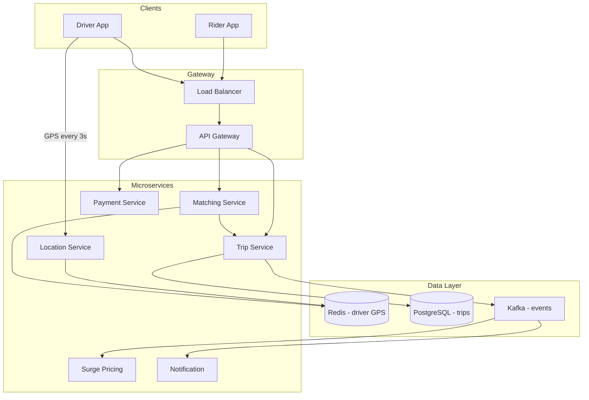
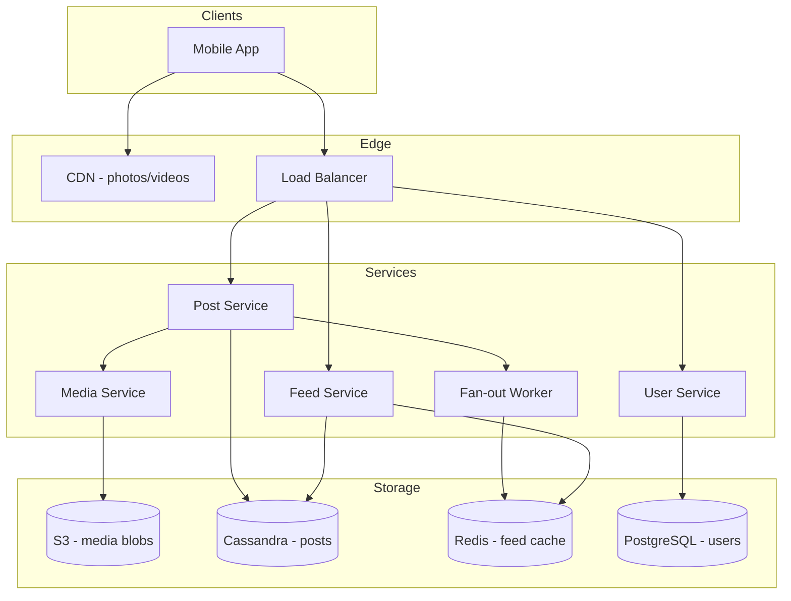
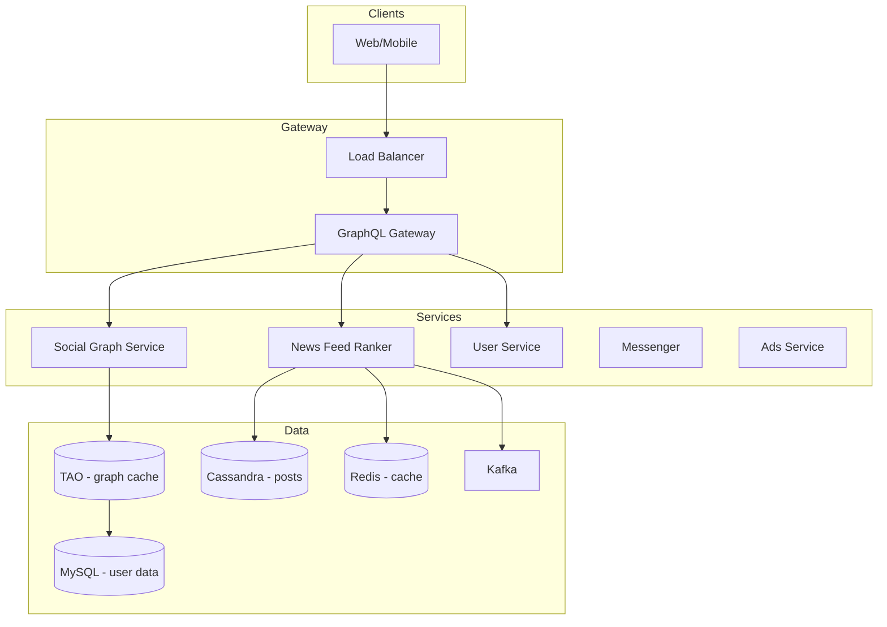
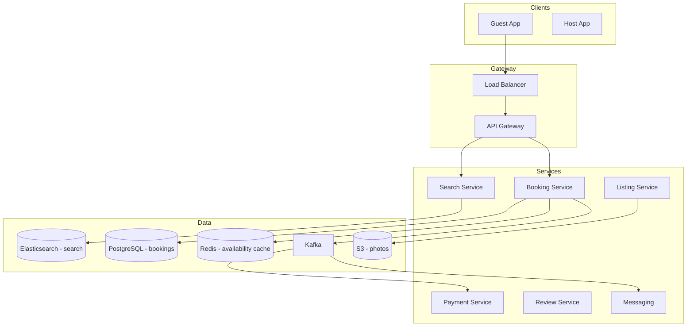
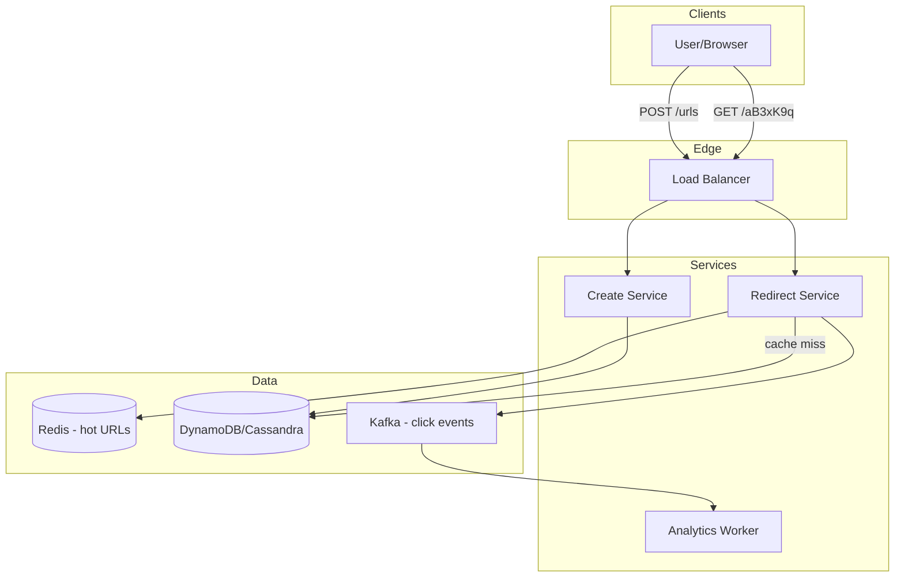
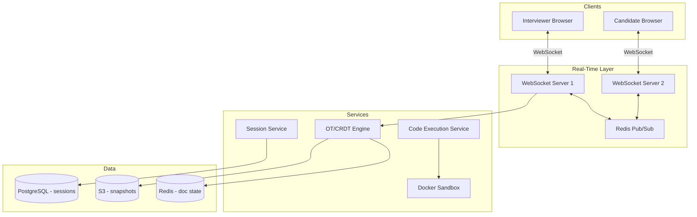

# System Design — Complete Guide

One-stop reference for system design interviews: **core building blocks** and **how top products are built** (Uber, Instagram, Facebook, Airbnb, URL Shortener, Real-Time Coding).

---

## Table of Contents

1. [How to Approach Any Design](#how-to-approach-any-design)
2. [Core Building Blocks](#core-building-blocks)
   - [Load Balancing](#load-balancing)
   - [Sharding](#sharding)
   - [Indexing](#indexing)
   - [Databases](#databases)
   - [Caching](#caching)
   - [API Design](#api-design)
   - [Hashing (SHA)](#hashing-sha)
   - [Encryption](#encryption)
   - [CDN](#cdn)
   - [Message Queues](#message-queues)
   - [CAP Theorem](#cap-theorem)
3. [Product Designs](#product-designs)
   - [Uber](#1-uber)
   - [Instagram](#2-instagram)
   - [Facebook](#3-facebook)
   - [Airbnb](#4-airbnb)
   - [URL Shortener](#5-url-shortener)
   - [Real-Time Coding Platform](#6-real-time-coding-platform)
4. [Master Interview Q&A](#master-interview-qa)

---

## How to Approach Any Design

```
1. Clarify requirements     → functional + non-functional (scale, latency, consistency)
2. Back-of-envelope math    → DAU, QPS, storage, bandwidth
3. High-level diagram       → Client → CDN → LB → Services → DB/Cache/Queue
4. Data model + APIs        → entities, endpoints, read/write paths
5. Deep dive bottlenecks    → sharding, caching, async, replication
6. Trade-offs               → CAP, SQL vs NoSQL, push vs pull feed
```

**Rough scale guide**

| DAU | Typical stack |
|-----|---------------|
| 1M | Monolith + read replicas + Redis |
| 10M | Microservices + sharding + CDN + Kafka |
| 100M+ | Multi-region + eventual consistency + dedicated infra |

---

## Core Building Blocks

### Load Balancing

Distributes incoming traffic across multiple servers so no single machine is overloaded.

```
                    ┌─────────────┐
  Clients ──────────► │ Load        │ ──► Server 1
                    │ Balancer    │ ──► Server 2
                    │ (L4/L7)     │ ──► Server 3
                    └─────────────┘
```

| Layer | Examples | Routes on |
|-------|----------|-----------|
| L4 (Transport) | AWS NLB, HAProxy | IP + port |
| L7 (Application) | NGINX, AWS ALB | URL path, headers, cookies |

**Algorithms:** Round robin · Least connections · Weighted · IP hash (sticky sessions)

**Health checks:** LB pings `/health` — unhealthy nodes removed automatically.

**Where used:** Every product below puts an LB in front of API servers. Uber uses geo-aware LB to route to nearest region.

---

### Sharding

Splitting data horizontally across multiple databases when one machine can't hold or serve all data.

```
                    ┌──────────┐  user_id % 4 == 0
                    │ Router   │──────────────► Shard 0
  App ──────────────► │ (shard   │──────────────► Shard 1
                    │  key)    │──────────────► Shard 2
                    └──────────┘──────────────► Shard 3
```

| Strategy | Shard key | Good for |
|----------|-----------|----------|
| Range | user_id 1–1M, 1M–2M | Time-series, logs |
| Hash | `hash(user_id) % N` | Even distribution |
| Geo | country/region | Uber, Airbnb search |
| Directory | lookup table | Flexible re-sharding |

**Challenges:** Cross-shard joins (avoid), hot shards (consistent hashing), re-sharding (double-write migration).

**Where used:** Facebook shards social graph by `user_id`. Instagram shards posts/photos by `user_id`. Uber shards trips by `city_id`.

---

### Indexing

Data structures that speed up reads at the cost of write overhead and storage.

| Type | Structure | Use case |
|------|-----------|----------|
| B-Tree | Balanced tree | Range queries, `ORDER BY`, SQL default |
| Hash | Hash table | Exact match `WHERE id = ?` |
| Composite | Multiple columns | `(user_id, created_at)` feed queries |
| Geospatial | R-tree, Geohash | Uber driver location, Airbnb map search |
| Full-text | Inverted index | Facebook/Instagram search, Airbnb listing text |

**Example — Instagram feed query:**
```sql
-- Composite index on (user_id, created_at DESC)
SELECT * FROM posts WHERE user_id = 123 ORDER BY created_at DESC LIMIT 20;
```

**Rules:** Index columns in `WHERE`, `JOIN`, `ORDER BY`. Avoid indexing low-cardinality columns alone. Covering indexes include all SELECT columns to skip table lookup.

---

### Databases

| | SQL (PostgreSQL, MySQL) | NoSQL |
|---|--------------------------|-------|
| **Model** | Tables, rows, joins | Document, key-value, wide-column, graph |
| **Schema** | Fixed, migrations | Flexible |
| **Scale** | Vertical + read replicas + sharding | Built for horizontal scale |
| **Consistency** | Strong (ACID) | Often eventual |
| **Best for** | Transactions, relations | High write volume, flexible schema |

**Replication patterns:**
- **Primary-replica** — writes to primary, reads from replicas (Instagram profiles)
- **Multi-primary** — writes to any node (conflict resolution needed)
- **Leaderless** — Dynamo-style quorum reads/writes (Cassandra)

**Product picks:**

| Product | SQL | NoSQL / Other |
|---------|-----|---------------|
| Uber | Trips, payments (PostgreSQL) | Driver locations (Redis), events (Kafka) |
| Instagram | User accounts | Posts, feeds (Cassandra), media metadata |
| Facebook | Ads billing | Social graph (TAO), messages (HBase) |
| Airbnb | Bookings, payments | Listings search (Elasticsearch) |
| URL Shortener | — | Key-value (DynamoDB/Redis) for mappings |
| Real-Time Coding | Sessions, users | Code snapshots (S3), presence (Redis) |

---

### Caching

Store frequently accessed data in fast memory (Redis/Memcached) to reduce DB load.

**Cache-aside (lazy loading):**
```
1. Read cache → hit? return
2. Miss → read DB → write cache → return
3. Write → update DB → invalidate/delete cache
```

| Pattern | When |
|---------|------|
| Cache-aside | General reads (profiles, URL mappings) |
| Write-through | Cache and DB updated together |
| Write-back | Batch writes to DB later |
| CDN cache | Static assets, images, videos |

**TTL strategy:** Short TTL for volatile data (Uber surge pricing). Long TTL + invalidation for profiles.

**Where used:** Instagram caches hot feeds in Redis. URL shortener caches `short_code → long_url` in Redis (sub-ms redirects).

---

### API Design

**REST** — resource-oriented, stateless, HTTP verbs.

```
GET    /v1/users/{id}/posts       → list posts
POST   /v1/rides                  → request ride (Uber)
GET    /v1/urls/{code}            → redirect (URL shortener)
WebSocket /v1/sessions/{id}/ws   → real-time coding sync
```

**Best practices:**
- Version in URL (`/v1/`) or header
- Pagination: `?cursor=abc&limit=20` (not offset for large datasets)
- Rate limiting: token bucket per API key / user (Redis)
- Idempotency keys for payments (Airbnb bookings, Uber trips)
- GraphQL for mobile clients needing flexible queries (Facebook/Instagram apps)

---

### Hashing (SHA)

| Algorithm | Purpose | Reversible? |
|-----------|---------|-------------|
| SHA-256 | Password hashing (with salt+bcrypt/scrypt), integrity checks | No |
| MD5 | Legacy — don't use for security | No |
| Consistent hashing | Shard/key distribution across nodes | — |
| Base62 encode | URL shortener codes | Yes (encoding, not encryption) |

**URL shortener flow:**
```
long_url → hash (MD5/SHA) → take first 7 bytes → Base62 encode → "aB3xK9q"
Store: { "aB3xK9q": "https://example.com/very/long/url" }
```

**Consistent hashing:** When adding/removing cache/DB nodes, only ~1/N keys move (not all keys). Used in CDNs, DynamoDB, Cassandra.

**Password storage:** Never store plain text. Use `bcrypt(password + unique_salt)` — SHA alone is too fast for passwords (GPU crackable).

---

### Encryption

| Layer | Method | Protects |
|-------|--------|----------|
| In transit | TLS 1.3 (HTTPS) | Client ↔ server traffic |
| At rest | AES-256 | Database disks, S3 objects |
| Application | Field-level encryption | PII, payment tokens |
| End-to-end | Signal protocol style | WhatsApp/Messenger messages |

**Uber/Airbnb payments:** PCI-DSS compliant — tokenize card numbers (Stripe), never store CVV, encrypt PII at rest.

**Key management:** AWS KMS / HashiCorp Vault — rotate keys, audit access.

---

### CDN

Edge servers worldwide cache static content close to users.

```
User (Tokyo) ──► CDN PoP (Tokyo) ──► cache HIT → fast
                              └──► cache MISS → Origin (US) → cache + serve
```

**Cached:** Instagram/Facebook photos & videos, Airbnb listing images, JS/CSS bundles.  
**Not cached:** Personalized feeds, ride status, booking confirmations (dynamic, user-specific).

**Providers:** CloudFront, Cloudflare, Akamai.

---

### Message Queues

Decouple producers and consumers for async, reliable processing.

```
API Server ──► Kafka/RabbitMQ/SQS ──► Workers
                  │
                  ├──► Feed generation worker
                  ├──► Notification service
                  ├──► Analytics pipeline
                  └──► Email/SMS sender
```

| System | Strength |
|--------|----------|
| Kafka | High throughput, event log, replay (Uber trip events) |
| RabbitMQ | Task queues, routing |
| SQS | Managed, simple AWS integration |

**Patterns:** Pub/sub (Instagram post → notify followers). Event sourcing (Uber trip state machine). CQRS (separate read/write models for feeds).

---

### CAP Theorem

In a network partition, choose **Consistency** or **Availability** (not both).

| Choice | Behavior | Example |
|--------|----------|---------|
| CP | Reject writes/reads until consistent | Bank transfers, Airbnb booking inventory |
| AP | Serve stale data, sync later | Instagram like counts, Facebook feed |
| CA | Only without partitions (single node) | Not realistic at scale |

Most social products pick **AP** for feeds/likes, **CP** for payments/bookings.

---

## Product Designs

---

### 1. Uber

**What it does:** Match riders with nearby drivers in real time, handle payments, surge pricing, trip tracking.

#### Requirements

| Functional | Non-functional |
|------------|----------------|
| Request ride, track driver | Low latency matching (< 1s) |
| Surge pricing | 100M+ users, millions of concurrent trips |
| Payments, ratings | 99.9% availability |
| Ride history | Geo-partitioned by city |

#### High-Level Architecture



#### How It Works

1. **Driver location:** Drivers send GPS every 3–4 seconds → Location Service → **Redis Geospatial index** (`GEOADD`, `GEORADIUS`).
2. **Ride request:** Rider POST `/rides` → Matching Service queries Redis for drivers within 5 km → ranks by distance, rating, acceptance rate.
3. **Trip lifecycle:** `REQUESTED → ACCEPTED → IN_PROGRESS → COMPLETED` stored in PostgreSQL, events published to **Kafka** for notifications, billing, analytics.
4. **Surge pricing:** Surge Service consumes demand/supply ratio per geo-cell from Kafka → multiplier cached in Redis.
5. **Sharding:** Trips sharded by `city_id`. Driver locations partitioned by geohash region.

#### Key APIs

```
POST   /v1/rides                    { pickup_lat, pickup_lng, dest_lat, dest_lng }
GET    /v1/rides/{id}                trip status + driver location
POST   /v1/rides/{id}/accept        (driver)
PUT    /v1/drivers/location         { lat, lng }  (every 3s)
GET    /v1/surge?lat=&lng=           surge multiplier
```

#### Interview Q&A

**Q: How do you find nearby drivers quickly?**  
A: Redis Geospatial index (or Geohash in Cassandra). `GEORADIUS` returns drivers within radius in O(log N). Location updates overwrite previous position.

**Q: How handle driver going offline mid-match?**  
A: TTL on location keys (15s expiry). Matching checks heartbeat. Trip assignment uses distributed lock (Redis Redlock) to prevent double-booking.

**Q: SQL or NoSQL for trips?**  
A: PostgreSQL for ACID (payments, trip state). Redis for ephemeral location. Kafka for event stream.

---

### 2. Instagram

**What it does:** Share photos/videos, follow users, home feed, stories, DMs.

#### Requirements

| Functional | Non-functional |
|------------|----------------|
| Post photo/video | Feed load < 500ms |
| Follow, like, comment | 2B+ users, billions of posts |
| Home feed | High read:write ratio (~100:1) |
| Stories (24h expiry) | Global CDN for media |

#### High-Level Architecture



#### How It Works — Feed Generation

**Problem:** User follows 500 people. Each posts → naively scan 500 timelines on every read = too slow.

**Solution — Hybrid fan-out:**

| User type | Strategy |
|-----------|----------|
| Normal user (< 10K followers) | **Push (fan-out on write):** on post, write post_id to each follower's feed cache (Redis sorted set) |
| Celebrity (> 10K followers) | **Pull (fan-out on read):** merge celebrity posts at read time |
| Active user feed read | Read pre-built Redis feed → fetch post details from Cassandra |

**Media pipeline:** Upload → Media Service → resize (thumbnail, medium, full) → S3 → CDN URL returned → metadata in Cassandra.

**Stories:** TTL 24h in Redis/Cassandra with expiration. Separate lightweight storage (not in main feed).

#### Data Model (simplified)

```
users:           user_id, username, bio, profile_pic_url
posts:           post_id, user_id, media_url, caption, created_at  (Cassandra, partition by user_id)
follows:         follower_id, followee_id
feeds:           user_id → sorted set of post_ids (Redis)
```

#### Interview Q&A

**Q: Push vs pull fan-out?**  
A: Push: fast reads, slow writes for celebrities. Pull: slow reads if many follows. Hybrid: push for normal, pull for celebrities.

**Q: How store photos?**  
A: Object storage (S3) + CDN. DB stores metadata/URLs only. Multiple resolutions pre-generated on upload.

**Q: How scale likes?**  
A: Counter in Redis (AP, eventual consistency). Periodic flush to Cassandra. Don't write one row per like at billion scale.

---

### 3. Facebook

**What it does:** Social graph, news feed, messenger, groups, events, ads — largest social graph on earth.

#### Requirements

| Functional | Non-functional |
|------------|----------------|
| Friend connections, feed | Graph queries at scale |
| News feed ranking | 3B+ users |
| Messenger | Complex privacy (friend-of-friend) |
| Groups, events | Multi-region |

#### High-Level Architecture



#### How It Works

1. **Social graph:** Stored in MySQL, cached in **TAO** (Facebook's graph cache — custom read-optimized layer). Query: "friends of user X", "mutual friends".
2. **News feed:** Not chronological — **ML ranker** scores posts by engagement probability. Candidate generation (friends + groups + pages) → rank → filter → cache top N in Redis.
3. **Fan-out:** Similar hybrid to Instagram. Write path publishes to Kafka → feed workers update follower feeds asynchronously.
4. **Messenger:** Separate real-time infra — WebSocket connections to chat servers, messages in HBase/Cassandra, delivery receipts via long polling or WebSocket.
5. **Privacy:** Graph service enforces visibility (public/friends/custom) before any feed candidate is returned.

#### Sharding Strategy

- `user_id` hash for user data and posts
- Graph edges stored adjacency list: `(user_id) → [friend_ids]`
- Cross-shard friend queries aggregated at TAO layer

#### Interview Q&A

**Q: How is Facebook different from Instagram architecturally?**  
A: Heavier graph queries (groups, events, complex privacy), ML ranking layer, TAO graph cache, separate messenger infra.

**Q: How suggest friends?**  
A: Offline batch jobs (MapReduce/Spark) compute mutual friends, shared groups, contact import matches. Results pre-computed and cached.

**Q: How handle hot users (celebrities)?**  
A: Pull model for feed fan-out. Rate limit post frequency. Dedicated cache for celebrity content.

---

### 4. Airbnb

**What it does:** Search listings, book stays, payments, reviews, host/guest messaging.

#### Requirements

| Functional | Non-functional |
|------------|----------------|
| Search by location, dates, filters | Search latency < 200ms |
| Booking with calendar availability | No double-booking (strong consistency) |
| Payments, refunds | Global listings |
| Reviews, messaging | Peak travel season spikes |

#### High-Level Architecture



#### How It Works

1. **Search:** Listings indexed in **Elasticsearch** with geo-point (lat/lng), price, amenities, availability dates. Geo + filter query returns ranked results.
2. **Availability calendar:** Each listing has date → status map. Stored in PostgreSQL, hot dates cached in Redis.
3. **Booking flow (must be CP):**
   ```
   BEGIN TRANSACTION
     SELECT dates FROM availability WHERE listing_id=X AND dates overlap FOR UPDATE
     IF available → INSERT booking, mark dates unavailable
   COMMIT
   ```
   Distributed lock or DB row lock prevents double-booking.
4. **Payments:** Stripe/PayPal integration. Idempotency key on `POST /bookings`. Escrow: charge guest → hold → release to host after check-in.
5. **Reviews:** Both guest and host review within 14 days. Immutable after publish. Aggregated rating updated async via Kafka worker.

#### Key APIs

```
GET  /v1/search?lat=&lng=&check_in=&check_out=&guests=2
GET  /v1/listings/{id}
POST /v1/bookings          { listing_id, check_in, check_out, guest_id }
POST /v1/bookings/{id}/pay
POST /v1/listings/{id}/reviews
```

#### Interview Q&A

**Q: Why Elasticsearch for search?**  
A: Full-text, geo queries, faceted filters (price range, amenities), scoring/ranking. SQL geo queries don't scale to millions of listings.

**Q: How prevent double-booking?**  
A: Pessimistic locking (`SELECT FOR UPDATE`) or optimistic locking with version column. Booking service is CP — reject if dates taken.

**Q: How handle search spikes (holiday season)?**  
A: Cache popular city searches in Redis. Pre-warm Elasticsearch replicas. CDN for listing photos.

---

### 5. URL Shortener

**What it does:** Convert long URLs to short codes (e.g. `bit.ly/aB3xK9q`), redirect with analytics.

#### Requirements

| Functional | Non-functional |
|------------|----------------|
| Shorten URL | Redirect latency < 10ms |
| Redirect to original | 100M+ URLs, 10K redirects/sec |
| Optional expiry, analytics | 99.99% availability |
| Custom aliases | |

#### High-Level Architecture



#### How It Works

**Encoding (create short code):**
```
Option A — Counter + Base62:
  id = global_counter.increment()   → 123456789
  code = base62(id)                 → "aB3xK9q"

Option B — Hash:
  hash = MD5(long_url)[:7]
  if collision → append salt, retry
```

**Redirect (hot path — 100:1 read:write):**
```
1. GET /aB3xK9q
2. Check Redis → HIT: 302 redirect (sub-ms)
3. MISS → DynamoDB lookup → populate Redis → 302 redirect
4. Publish click event to Kafka (async analytics)
```

**Storage schema:**
```
short_code (PK)  |  long_url  |  user_id  |  created_at  |  expires_at
"aB3xK9q"        |  https://... |  42     |  2026-01-01  |  null
```

**Capacity estimate:**
- 100M URLs × 500 bytes ≈ 50 GB → fits one DB shard + Redis cache for hot 20%

#### Interview Q&A

**Q: Counter vs hash for short codes?**  
A: Counter + Base62: no collisions, predictable length, needs coordinated counter (Redis/Zookeeper). Hash: stateless but collision handling needed.

**Q: 301 vs 302 redirect?**  
A: 302 (temporary) — analytics track every click, can change destination. 301 cached by browsers — better for permanent links, worse for analytics.

**Q: How scale redirects?**  
A: Redis cache for hot URLs, read replicas, CDN edge redirects for most popular links, geo-distributed DB.

---

### 6. Real-Time Coding Platform

**What it does:** Collaborative code editor (like CoderPad, HackerRank live interview, Replit) — multiple users edit code simultaneously, run code in sandbox, video/chat.

#### Requirements

| Functional | Non-functional |
|------------|----------------|
| Shared code editor | Edit latency < 100ms |
| Run code in sandbox | Isolated execution (security) |
| Video/voice (optional) | Support 2–10 participants |
| Session replay | Language support (Python, JS, Java) |

#### High-Level Architecture



#### How It Works

1. **Session creation:** `POST /sessions` → Session Service creates room, returns `session_id` + WebSocket URL.
2. **Real-time sync:** Clients connect via **WebSocket**. Code changes sent as **Operational Transformation (OT)** or **CRDT** deltas — not full document each time.
3. **Multi-server sync:** WebSocket servers publish changes to **Redis Pub/Sub** channel per session — all servers relay to their connected clients.
4. **Code execution:**
   ```
   POST /sessions/{id}/run  { language: "python", code: "..." }
   → Code Exec Service → spin Docker container (no network, CPU/memory limit, 5s timeout)
   → capture stdout/stderr → return to clients via WebSocket
   ```
5. **Persistence:** Periodic snapshots to S3. Full edit history for replay (git-style or event log).
6. **Load balancing:** Sticky sessions (IP hash) so WebSocket stays on same server; fallback: Redis Pub/Sub bridges servers.

#### Key APIs

```
POST   /v1/sessions                     { language, template }
GET    /v1/sessions/{id}
WS     /v1/sessions/{id}/ws             real-time edits
POST   /v1/sessions/{id}/run            execute code
GET    /v1/sessions/{id}/replay         playback
```

#### Security (Sandbox)

| Threat | Mitigation |
|--------|------------|
| Network access | `--network=none` in Docker |
| File system | Read-only root, tmpfs for /tmp |
| Resource exhaustion | CPU/memory/time limits |
| Fork bombs | pid limits, seccomp |
| Code injection | Separate container per run, destroyed after |

#### Interview Q&A

**Q: WebSocket vs polling for code sync?**  
A: WebSocket — full duplex, low latency, persistent connection. Polling wastes bandwidth and adds 1–5s delay unsuitable for typing sync.

**Q: OT vs CRDT?**  
A: OT transforms operations against concurrent edits (Google Docs style). CRDT mathematically converges without central server — better for offline/P2P. OT more common in interview platforms.

**Q: How run untrusted code safely?**  
A: Docker/gVisor sandbox per execution. No network, strict timeouts, destroy container after run. Never run on shared host process.

**Q: How scale WebSockets?**  
A: Sticky LB + Redis Pub/Sub between WS servers. Each session pinned to a channel. Horizontal scale WS servers independently.

---

## Master Interview Q&A

### Cross-cutting

**Q: How do you estimate system capacity?**  
A: DAU → peak QPS (DAU × actions/day × peak_factor / 86400). Storage = records × size × retention. Bandwidth = QPS × payload size.

**Q: When SQL vs NoSQL?**  
A: SQL for transactions, joins, consistency (bookings, payments). NoSQL for high write volume, flexible schema, horizontal scale (feeds, logs, URL mappings).

**Q: How handle a traffic spike 10× normal?**  
A: Auto-scaling groups, CDN absorbs read spike, queue buffers write spike, rate limiting protects backend, pre-warmed caches.

**Q: Single region vs multi-region?**  
A: Single region simpler until latency or DR requirements force multi-region. Multi-region adds data replication complexity (conflict resolution).

**Q: Microservices vs monolith?**  
A: Monolith first for startups. Microservices when teams scale, independent deploy needed, or components have very different resource profiles (Uber matching vs payments).

### Product-specific quick answers

| Product | #1 interview question | Answer in one line |
|---------|----------------------|-------------------|
| Uber | Find nearby drivers? | Redis Geospatial / Geohash index |
| Instagram | Feed generation? | Hybrid push/pull fan-out + Redis cache |
| Facebook | Social graph at scale? | TAO cache layer + MySQL sharded by user_id |
| Airbnb | No double-booking? | DB transaction with row lock / optimistic locking |
| URL Shortener | Scale redirects? | Redis cache + Base62 counter + CDN |
| Real-Time Coding | Sync edits? | WebSocket + OT/CRDT + Redis Pub/Sub |

---

## Quick Reference — What Each Product Uses

| Concept | Uber | Instagram | Facebook | Airbnb | URL Shortener | Real-Time Coding |
|---------|------|-----------|----------|--------|---------------|------------------|
| Load Balancer | ✅ | ✅ | ✅ | ✅ | ✅ | ✅ (sticky WS) |
| Sharding | city_id | user_id | user_id | listing region | hash(code) | session_id |
| Indexing | Geospatial | Composite feed | Graph (TAO) | Elasticsearch geo | PK lookup | session_id |
| Cache | Redis GPS | Redis feed | Redis + TAO | Redis availability | Redis URLs | Redis doc state |
| Message Queue | Kafka | Kafka | Kafka | Kafka | Kafka analytics | Redis Pub/Sub |
| CDN | — | Photos/videos | Static assets | Listing photos | — | — |
| Encryption | TLS + PCI | TLS + at-rest | TLS + E2E msg | TLS + PCI | TLS | TLS + sandbox |
| Hashing | — | — | — | — | Base62/MD5 | — |
| SQL | PostgreSQL | PostgreSQL | MySQL | PostgreSQL | — | PostgreSQL |
| NoSQL | Redis | Cassandra | Cassandra/HBase | Elasticsearch | DynamoDB | Redis |

---

*All content in this single guide. Run through one product end-to-end before interviews, then review building blocks for cross-cutting questions.*
