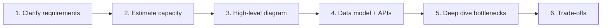

# System Design

Interview-focused system design — **one folder per product**, each with full architecture, mermaid diagrams, database schemas, indexing strategies, sharding, APIs, and Q&A.

## Companies & Products

| Folder | Product | Key challenge | What's inside |
|--------|---------|---------------|---------------|
| [uber/](./uber/) | Uber | Real-time driver matching, geospatial indexing | Architecture, sequence, ER, sharding, state machine diagrams · PostgreSQL DDL · Redis/Kafka indexing · Geohash · Q&A |
| [instagram/](./instagram/) | Instagram | Feed fan-out, media CDN, billion-scale likes | Push/pull fan-out diagrams · Cassandra/PostgreSQL schemas · CDN pipeline · Like counter · Q&A |
| [facebook/](./facebook/) | Facebook | Social graph (TAO), ML feed ranking | TAO graph layer · News feed ranking pipeline · Cassandra/MySQL schemas · Graph indexing · Q&A |
| [airbnb/](./airbnb/) | Airbnb | Geo search, booking consistency, payments | Search + booking flow diagrams · Elasticsearch geo indexing · PostgreSQL DDL · Payment idempotency · Q&A |
| [url-shortener/](./url-shortener/) | bit.ly / TinyURL | Base62 encoding, redirect at scale | Create/redirect sequences · DynamoDB + ClickHouse schemas · 3-tier cache · Base62 encoding · Q&A |
| [realtime-coding/](./realtime-coding/) | CoderPad / HackerRank Live | WebSocket sync, code sandbox | OT sync sequence · Docker sandbox security · PostgreSQL + Redis schemas · Replay system · Q&A |

## Diagram Types (in every design)

Each product README includes multiple **mermaid diagrams**:

| Diagram type | Purpose | Example |
|-------------|---------|---------|
| **Architecture** | High-level component layout | Client → CDN → LB → Services → DB/Cache/Queue |
| **Sequence** | Request flow step-by-step | Create URL, redirect, book listing, match driver |
| **ER / Data model** | Entity relationships | Users, trips, listings, sessions |
| **Sharding** | How data is partitioned | city_id, user_id, geohash, short_code |
| **State machine** | Lifecycle transitions | Trip: requested → matched → completed |
| **Cache layers** | CDN → Redis → DB hit rates | URL redirect 3-tier cache |
| **Security** | Isolation, encryption flow | Docker sandbox, TLS, PCI |

## Core Building Blocks (used across all designs)

| Concept | Used for | Details in |
|---------|----------|------------|
| **Load Balancing** | Distribute traffic — L4/L7, round robin, sticky sessions (WebSocket) | All folders |
| **Sharding** | Partition DB by `user_id`, `city_id`, geohash, `short_code` | Uber, Instagram, URL Shortener |
| **Indexing** | B-tree, composite, geospatial (PostGIS), inverted (Elasticsearch), GSI (DynamoDB) | Uber, Airbnb, URL Shortener |
| **Databases** | SQL (ACID: trips, bookings) · NoSQL (feeds, URLs, locations) | Each folder has full DDL |
| **Caching** | Redis — feeds, GPS, URL mappings, availability calendars, doc state | All folders |
| **API Design** | REST + GraphQL + WebSocket; pagination, rate limits, idempotency | Each folder has API table |
| **Hashing** | SHA-256 (passwords), Base62 (URL codes), consistent hashing (shards) | URL Shortener, Facebook |
| **Encryption** | TLS in-transit, AES at-rest, PCI for payments | Uber, Airbnb |
| **CDN** | Photos, videos, static assets, hot URL redirects | Instagram, Facebook, URL Shortener |
| **Message Queues** | Kafka — async fan-out, analytics, notifications | Uber, Instagram, URL Shortener |
| **CAP Theorem** | CP for bookings/payments · AP for feeds/likes | Airbnb, Instagram |

## How to approach any interview



```
1. Clarify requirements  →  functional + scale (DAU, QPS, read/write ratio)
2. Estimate capacity     →  storage, bandwidth, servers
3. High-level diagram    →  Client → CDN → LB → Services → DB/Cache/Queue
4. Data model + APIs     →  entities, endpoints, indexing
5. Deep dive             →  bottlenecks, sharding, caching, consistency
6. Trade-offs            →  CAP, SQL vs NoSQL, push vs pull
```

## Scale guide

| DAU | Stack |
|-----|-------|
| 1M | Monolith + read replicas + Redis |
| 10M | Microservices + sharding + CDN + Kafka |
| 100M+ | Multi-region + eventual consistency |

## Quick comparison

| Concept | Uber | Instagram | Facebook | Airbnb | URL Shortener | Real-Time Coding |
|---------|------|-----------|----------|--------|---------------|------------------|
| Load Balancer | ✅ | ✅ | ✅ | ✅ | ✅ | ✅ sticky WS |
| Sharding | city_id | user_id | user_id | region | hash(code) | session_id |
| Cache | Redis GPS | Redis feed | TAO + Redis | Redis cal | Redis URLs | Redis doc |
| Queue | Kafka | Kafka | Kafka | Kafka | Kafka | Redis Pub/Sub |
| SQL | PostgreSQL | PostgreSQL | MySQL | PostgreSQL | — | PostgreSQL |
| NoSQL | Redis | Cassandra | Cassandra | Elasticsearch | DynamoDB | Redis |
| Mermaid diagrams | 6+ | 6+ | 6+ | 6+ | 5+ | 5+ |
| Full DB schema | ✅ | ✅ | ✅ | ✅ | ✅ | ✅ |
| Indexing tables | ✅ | ✅ | ✅ | ✅ | ✅ | ✅ |

Open any folder above for the **full detailed design** with diagrams, schemas, and interview Q&A.
