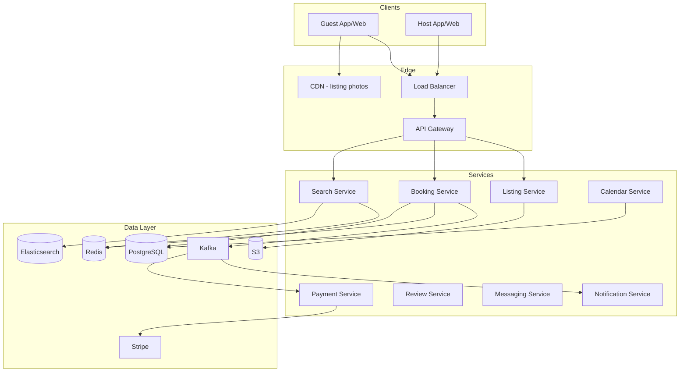

# Airbnb — System Design

Design a marketplace for short-term rentals: search listings by location/dates, book stays, handle payments, reviews, and host-guest messaging.

---

## Requirements

### Functional
- Search listings (location, dates, guests, filters)
- View listing details + availability calendar
- Book stay (no double-booking)
- Payments with escrow (charge guest, pay host after check-in)
- Reviews (guest ↔ host)
- Host/guest messaging

### Non-Functional
- Search latency **< 200ms**
- **No double-booking** — strong consistency (CP)
- Global listings (multi-currency, multi-language)
- Peak season traffic spikes (holidays)
- PCI-compliant payments

---

## Capacity Estimation

| Metric | Estimate |
|--------|----------|
| Listings | 7M active |
| Searches/day | 500M |
| Bookings/day | 1M |
| Peak search QPS | ~10,000/s |
| Listing photos | 7M × 20 photos × 1MB ≈ **140 TB** (S3 + CDN) |
| Booking records | 1M/day × 365 × 1KB ≈ **365 GB/year** |

---

## High-Level Architecture



---

## Core Flows

### 1. Search Listings

```
GET /v1/search?lat=48.8566&lng=2.3522&check_in=2026-07-01&check_out=2026-07-05&guests=2

Search Service:
  1. Check Redis cache for popular city+date queries
  2. Elasticsearch query:
     {
       "geo_distance": { "distance": "20km", "location": { lat, lng } },
       "filter": [
         { "range": { "price": { "lte": max_price } } },
         { "term": { "amenities": "wifi" } },
         { "bool": { "must_not": { "terms": { "blocked_dates": ["2026-07-01"...] } } } }
       ]
     }
  3. Rank by: relevance score, rating, Superhost boost, price
  4. Return paginated results with CDN photo URLs
```

**Why Elasticsearch?**
- Geo queries (lat/lng radius)
- Full-text (description, neighborhood)
- Faceted filters (price, amenities, room type)
- Scoring/ranking built-in

### 2. Booking Flow (CP — must be consistent)

```
POST /v1/bookings { listing_id, check_in, check_out, guest_id, total_price }

Booking Service:
  BEGIN TRANSACTION (PostgreSQL)
    1. SELECT * FROM availability
       WHERE listing_id = X
       AND date BETWEEN check_in AND check_out
       FOR UPDATE                          ← row lock!

    2. IF any date is 'booked': ROLLBACK → return 409 Conflict

    3. INSERT booking record
    4. UPDATE availability SET status='booked' for each date
  COMMIT

  Publish BookingCreated → Kafka → Payment Service
```

**Alternative — Optimistic locking:**
```sql
UPDATE availability SET status='booked', version=version+1
WHERE listing_id=X AND date=D AND version=expected_version
-- IF rows_affected = 0 → conflict, retry or fail
```

### 3. Payment Escrow

```
Kafka: BookingCreated → Payment Service:
  1. Charge guest via Stripe (with idempotency key)
  2. Hold funds in escrow (don't transfer to host yet)
  3. On check-in day → transfer to host minus service fee
  4. On cancellation → refund per cancellation policy
```

### 4. Reviews

```
Both guest and host can review within 14 days of checkout.
Reviews are blind until both submit (or 14 days pass).
Once published → immutable.
Kafka worker updates listing aggregate rating in Elasticsearch.
```

---

## Data Model

### PostgreSQL

```sql
listings (
  listing_id    BIGINT PRIMARY KEY,
  host_id       BIGINT,
  title         VARCHAR,
  description   TEXT,
  lat           DECIMAL, lng DECIMAL,
  price_per_night DECIMAL,
  max_guests    INT,
  amenities     JSONB
)

availability (
  listing_id    BIGINT,
  date          DATE,
  status        ENUM('available','booked','blocked'),
  booking_id    UUID,
  version       INT,              -- optimistic lock
  PRIMARY KEY (listing_id, date)
)

bookings (
  booking_id    UUID PRIMARY KEY,
  listing_id    BIGINT,
  guest_id      BIGINT,
  check_in      DATE,
  check_out     DATE,
  total_price   DECIMAL,
  status        ENUM('pending','confirmed','cancelled','completed'),
  idempotency_key VARCHAR UNIQUE
)
```

### Elasticsearch index

```json
{
  "listing_id": 12345,
  "location": { "lat": 48.8566, "lon": 2.3522 },
  "price": 120,
  "rating": 4.8,
  "amenities": ["wifi", "kitchen", "pool"],
  "blocked_dates": ["2026-07-01", "2026-07-02"],
  "title": "Cozy Paris apartment"
}
```

Synced from PostgreSQL via Kafka CDC (Change Data Capture).

---

## API Design

| Method | Endpoint | Description |
|--------|----------|-------------|
| GET | `/v1/search` | Search with geo + filters |
| GET | `/v1/listings/{id}` | Listing detail |
| GET | `/v1/listings/{id}/availability` | Calendar |
| POST | `/v1/bookings` | Create booking |
| POST | `/v1/bookings/{id}/pay` | Process payment |
| DELETE | `/v1/bookings/{id}` | Cancel |
| POST | `/v1/listings/{id}/reviews` | Submit review |
| GET | `/v1/conversations` | Messaging |

---

## Scaling Strategies

| Component | Strategy |
|-----------|----------|
| Search | Elasticsearch cluster, cache popular queries in Redis |
| Booking | PostgreSQL with connection pooling, shard by region if needed |
| Photos | S3 + CDN — never serve from origin |
| Peak season | Auto-scale search service, pre-warm ES caches |
| Payments | Async via Kafka — don't block booking response |

---

## Interview Q&A

**Q: Why Elasticsearch instead of PostgreSQL for search?**  
A: Geo-radius queries, full-text search, faceted filters, relevance scoring — all native in ES. SQL geo queries (PostGIS) don't scale to 500M searches/day with complex filters.

**Q: How prevent double-booking?**  
A: Pessimistic row lock (`SELECT FOR UPDATE`) in transaction. Only one booking transaction can hold the lock for overlapping dates. Return 409 if conflict.

**Q: How sync availability between PostgreSQL and Elasticsearch?**  
A: CDC (Change Data Capture) via Kafka. On booking, PG update → Kafka event → ES index updated with new blocked_dates.

**Q: How handle cancellation and refund?**  
A: State machine: CONFIRMED → CANCELLED. Refund amount based on policy (flexible/moderate/strict). Stripe refund API. Release availability dates in same transaction.

**Q: How scale holiday traffic spikes?**  
A: Redis cache for top 100 city searches. ES read replicas. CDN absorbs photo traffic. Booking service auto-scales (stateless except DB).

**Q: CP or AP for booking?**  
A: **CP** — must never double-book. Better to reject a booking (unavailable) than confirm two guests for same dates.

**Q: How handle multi-currency?**  
A: Store prices in listing's local currency. Convert at booking time using daily exchange rate API. Charge guest in their currency via Stripe.

---

## Tech Stack Summary

| Layer | Technology |
|-------|------------|
| Search | Elasticsearch |
| Bookings | PostgreSQL |
| Cache | Redis |
| Photos | S3 + CloudFront |
| Events | Apache Kafka |
| Payments | Stripe Connect |
| API | Ruby on Rails / Java microservices |

[← Back to index](../README.md)
