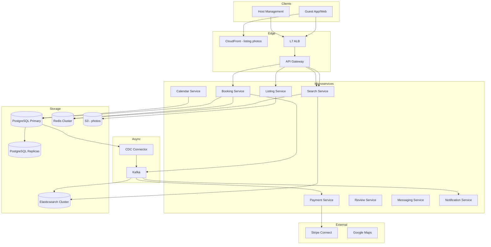
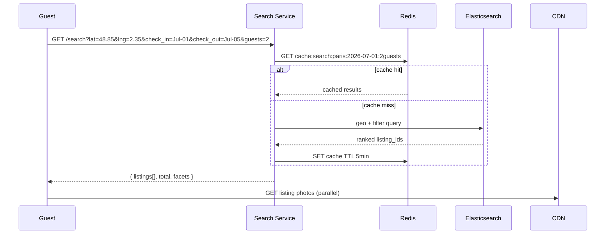
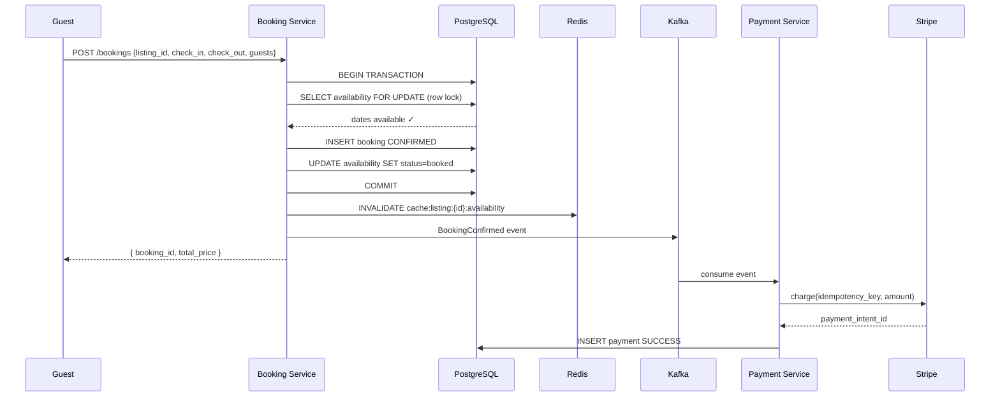
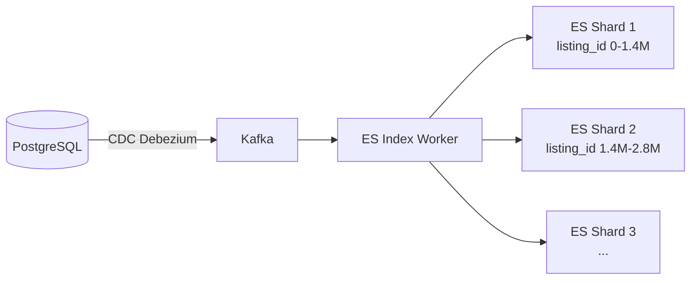
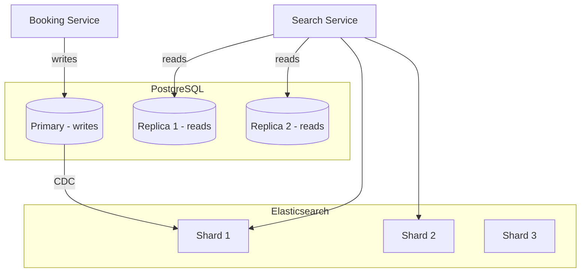
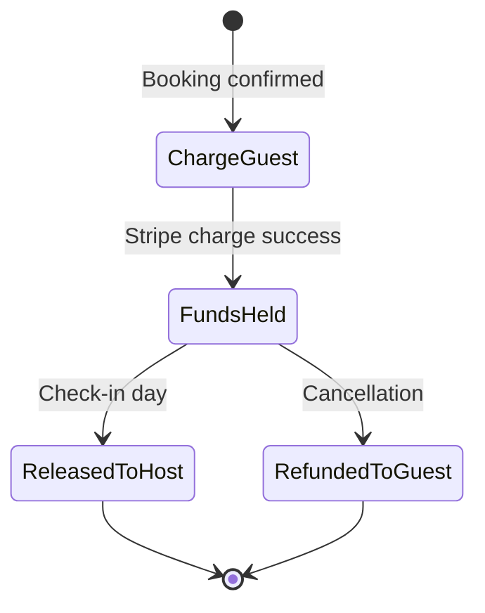
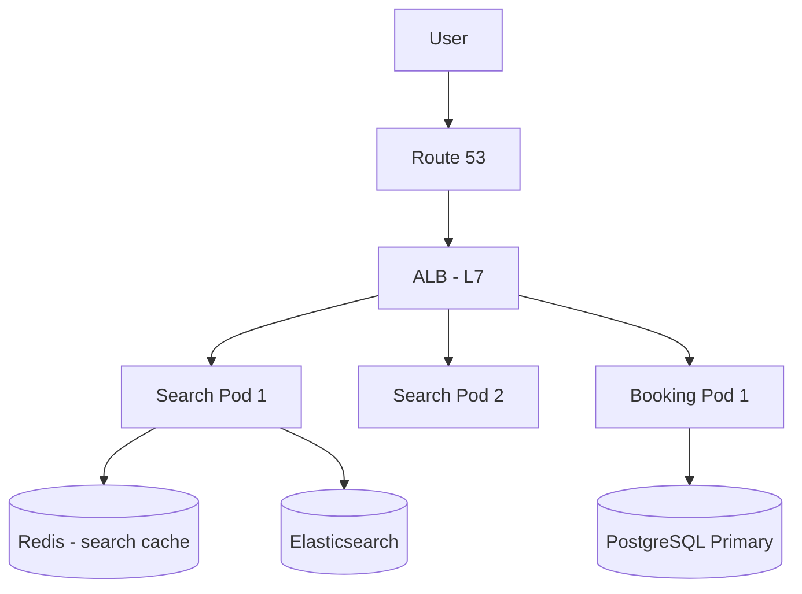

# Airbnb — System Design (Detailed)

Complete system design for a short-term rental marketplace — Elasticsearch geo search, booking consistency, payment escrow, reviews.

---

## 1. Requirements & Capacity

| Metric | Estimate |
|--------|----------|
| Active listings | 7M |
| Searches/day | 500M |
| Bookings/day | 1M |
| Peak search QPS | ~10,000/s |
| Listing photos | 7M × 20 × 1MB ≈ 140 TB |
| Booking records/year | 365M × 1KB ≈ 365 GB |

---

## 2. High-Level Architecture



---

## 3. Sequence Diagrams

### 3.1 Search Flow



### 3.2 Booking Flow (CP — Strong Consistency)



---

## 4. Database Schema (Detailed)

### 4.1 ER Diagram

```mermaid
erDiagram
    USERS ||--o{ LISTINGS : hosts
    USERS ||--o{ BOOKINGS : makes
    LISTINGS ||--o{ BOOKINGS : receives
    LISTINGS ||--o{ AVAILABILITY : has
    LISTINGS ||--o{ LISTING_PHOTOS : has
    LISTINGS ||--o{ REVIEWS : receives
    BOOKINGS ||--|| PAYMENTS : has
    BOOKINGS ||--o{ REVIEWS : generates

    USERS {
        bigint user_id PK
        varchar email UK
        varchar name
        enum role
        varchar stripe_account_id
        timestamp created_at
    }

    LISTINGS {
        bigint listing_id PK
        bigint host_id FK
        varchar title
        text description
        decimal lat
        decimal lng
        decimal price_per_night
        int max_guests
        int bedrooms
        jsonb amenities
        decimal rating_avg
        int review_count
        enum status
    }

    AVAILABILITY {
        bigint listing_id PK
        date date PK
        enum status
        uuid booking_id FK
        int version
    }

    BOOKINGS {
        uuid booking_id PK
        bigint listing_id FK
        bigint guest_id FK
        date check_in
        date check_out
        int guests
        decimal total_price
        decimal service_fee
        enum status
        varchar idempotency_key UK
        timestamp created_at
    }

    PAYMENTS {
        uuid payment_id PK
        uuid booking_id FK UK
        decimal amount
        enum status
        varchar stripe_intent_id UK
        timestamp created_at
    }

    REVIEWS {
        uuid review_id PK
        uuid booking_id FK
        bigint reviewer_id
        bigint reviewee_id
        int score
        text comment
        enum type
        timestamp created_at
    }
```

### 4.2 PostgreSQL DDL

```sql
CREATE TABLE listings (
    listing_id      BIGSERIAL PRIMARY KEY,
    host_id         BIGINT NOT NULL REFERENCES users(user_id),
    title           VARCHAR(200) NOT NULL,
    description     TEXT,
    lat             DECIMAL(10, 8) NOT NULL,
    lng             DECIMAL(11, 8) NOT NULL,
    price_per_night DECIMAL(10, 2) NOT NULL,
    max_guests      INT NOT NULL DEFAULT 2,
    bedrooms        INT,
    bathrooms       INT,
    amenities       JSONB DEFAULT '[]',
    house_rules     JSONB DEFAULT '[]',
    rating_avg      DECIMAL(3, 2) DEFAULT 0,
    review_count    INT DEFAULT 0,
    status          VARCHAR(20) DEFAULT 'active',
    created_at      TIMESTAMP DEFAULT NOW()
);

CREATE TABLE availability (
    listing_id      BIGINT NOT NULL,
    date            DATE NOT NULL,
    status          VARCHAR(20) NOT NULL DEFAULT 'available',
    booking_id      UUID,
    version         INT NOT NULL DEFAULT 0,
    PRIMARY KEY (listing_id, date)
);

CREATE TABLE bookings (
    booking_id      UUID PRIMARY KEY DEFAULT gen_random_uuid(),
    listing_id      BIGINT NOT NULL REFERENCES listings(listing_id),
    guest_id        BIGINT NOT NULL REFERENCES users(user_id),
    check_in        DATE NOT NULL,
    check_out       DATE NOT NULL,
    guests          INT NOT NULL,
    total_price     DECIMAL(10, 2) NOT NULL,
    service_fee     DECIMAL(10, 2),
    host_payout     DECIMAL(10, 2),
    status          VARCHAR(20) NOT NULL DEFAULT 'pending',
    idempotency_key VARCHAR(100) UNIQUE NOT NULL,
    created_at      TIMESTAMP DEFAULT NOW(),
    confirmed_at    TIMESTAMP,
    cancelled_at    TIMESTAMP
);
```

### 4.3 Indexing Strategy — PostgreSQL

| Index | Columns | Type | Purpose |
|-------|---------|------|---------|
| PK | `listing_id` | B-tree | Primary lookup |
| `idx_listings_host` | `(host_id, status)` | B-tree composite | Host dashboard: my listings |
| `idx_listings_location` | `(lat, lng)` | GiST (PostGIS) | Fallback geo query |
| `idx_listings_rating` | `(rating_avg DESC)` | B-tree | Sort by rating |
| `idx_availability_listing_date` | `(listing_id, date, status)` | B-tree composite | Booking availability check |
| `idx_bookings_guest` | `(guest_id, created_at DESC)` | B-tree composite | Guest trip history |
| `idx_bookings_listing` | `(listing_id, check_in)` | B-tree composite | Host calendar view |
| `idx_bookings_idempotency` | `(idempotency_key)` | B-tree UNIQUE | Prevent duplicate bookings |
| `idx_reviews_listing` | `(listing_id, created_at DESC)` | B-tree composite | Listing reviews page |

**Critical booking index:**
```sql
-- This query runs inside a transaction with FOR UPDATE:
SELECT date, status, version FROM availability
WHERE listing_id = $1
  AND date BETWEEN $2 AND $3
FOR UPDATE;

-- idx_availability_listing_date makes this O(log N + days)
-- NOT a full table scan
```

**GiST index for PostGIS (backup geo search):**
```sql
CREATE INDEX idx_listings_geo ON listings
USING GIST (ST_MakePoint(lng, lat));
-- Used when Elasticsearch is down (fallback)
```

---

## 5. Elasticsearch Index Design

```json
{
  "settings": {
    "number_of_shards": 5,
    "number_of_replicas": 2,
    "analysis": {
      "analyzer": {
        "listing_analyzer": {
          "type": "custom",
          "tokenizer": "standard",
          "filter": ["lowercase", "stemmer"]
        }
      }
    }
  },
  "mappings": {
    "properties": {
      "listing_id":    { "type": "long" },
      "title":         { "type": "text", "analyzer": "listing_analyzer" },
      "description":   { "type": "text", "analyzer": "listing_analyzer" },
      "location":      { "type": "geo_point" },
      "price":         { "type": "float" },
      "rating":        { "type": "float" },
      "review_count":  { "type": "integer" },
      "max_guests":    { "type": "integer" },
      "bedrooms":      { "type": "integer" },
      "amenities":     { "type": "keyword" },
      "property_type": { "type": "keyword" },
      "blocked_dates": { "type": "date", "format": "yyyy-MM-dd" },
      "instant_book":  { "type": "boolean" },
      "superhost":     { "type": "boolean" },
      "photo_url":     { "type": "keyword", "index": false }
    }
  }
}
```

**Search query example:**
```json
{
  "query": {
    "bool": {
      "filter": [
        { "geo_distance": {
            "distance": "20km",
            "location": { "lat": 48.8566, "lon": 2.3522 }
        }},
        { "range": { "price": { "lte": 200 } } },
        { "term": { "max_guests": { "gte": 2 } } },
        { "terms": { "amenities": ["wifi", "kitchen"] } },
        { "bool": { "must_not": {
            "terms": { "blocked_dates": ["2026-07-01","2026-07-02","2026-07-03","2026-07-04"] }
        }}}
      ],
      "should": [
        { "rank_feature": { "field": "rating" } },
        { "term": { "superhost": { "value": true, "boost": 1.5 } } }
      ]
    }
  },
  "sort": [{ "_score": "desc" }, { "price": "asc" }],
  "from": 0, "size": 20
}
```

### 5.1 Elasticsearch Indexing & Sharding



| ES Concept | Configuration | Reason |
|-----------|--------------|--------|
| Shards | 5 primary | 7M docs / 5 = 1.4M per shard (optimal) |
| Replicas | 2 | High search QPS, fault tolerance |
| Refresh interval | 5s | Near real-time availability updates |
| Field: location | geo_point | Native geo_distance queries |
| Field: blocked_dates | date array | Filter unavailable dates in query |

---

## 6. Sharding Strategy



| Data | Sharding | Reason |
|------|----------|--------|
| Listings | ES hash routing | Even search distribution |
| Bookings | PostgreSQL (single primary + replicas) | Strong consistency needed |
| Availability | Co-located with listing_id | Same shard as listing |
| Photos | S3 prefix `listings/{listing_id}/` | No hot partitions |
| Search cache | Redis hash slot by query hash | Popular city queries cached |

---

## 7. Payment Escrow Flow



**Stripe Connect flow:**
```
1. Guest charged $500 (total) on booking
2. $500 held in Airbnb Stripe platform account
3. Check-in day: transfer $420 to host Stripe Connect account
4. $80 retained as Airbnb service fee (14% + guest fee)
5. Cancellation: refund per policy (flexible/moderate/strict)
```

---

## 8. Load Balancing & Caching



| Cache Key | TTL | Invalidation |
|-----------|-----|-------------|
| `search:{city}:{dates}:{guests}` | 5 min | On new booking in city |
| `listing:{id}:detail` | 10 min | On listing update |
| `listing:{id}:availability:{month}` | 2 min | On booking/cancellation |
| `host:{id}:dashboard` | 5 min | On new booking |

---

## 9. Interview Q&A

**Q: Why Elasticsearch over PostgreSQL for search?**  
A: Native geo_distance queries, full-text with scoring, faceted filters (amenities, price range), handles 10K QPS search. PostGIS works but doesn't scale as well for complex ranked search.

**Q: How prevent double-booking?**  
A: `SELECT FOR UPDATE` row lock inside PostgreSQL transaction. Only one booking transaction can lock overlapping dates. Return HTTP 409 if conflict.

**Q: How sync availability to Elasticsearch?**  
A: CDC (Change Data Capture) via Debezium — PostgreSQL WAL → Kafka → ES index worker updates `blocked_dates` field. Near real-time (5s lag).

**Q: Optimistic vs pessimistic locking?**  
A: Pessimistic (`FOR UPDATE`) for booking — simpler, guarantees no conflict. Optimistic (version column) for listing edits — higher concurrency, retry on conflict.

**Q: CP or AP?**  
A: CP for bookings and payments. AP acceptable for search results (5-min cache staleness OK) and review counts.

**Q: How handle holiday search spikes?**  
A: Redis cache for top 100 city+date combos. ES read replicas auto-scale. CDN for photos. Booking service rate-limited separately from search.

[← Back to index](../README.md)
