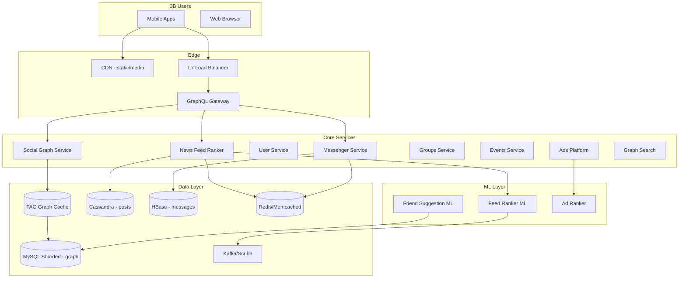
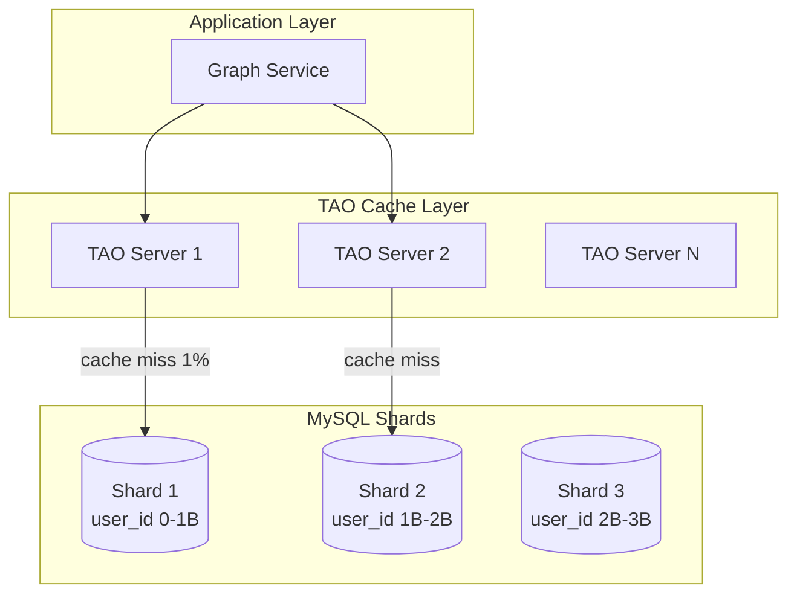
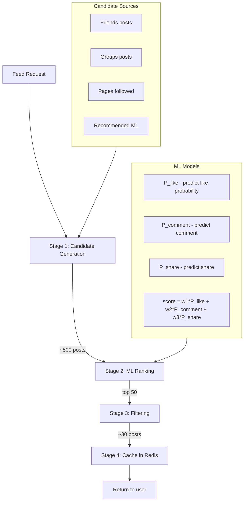
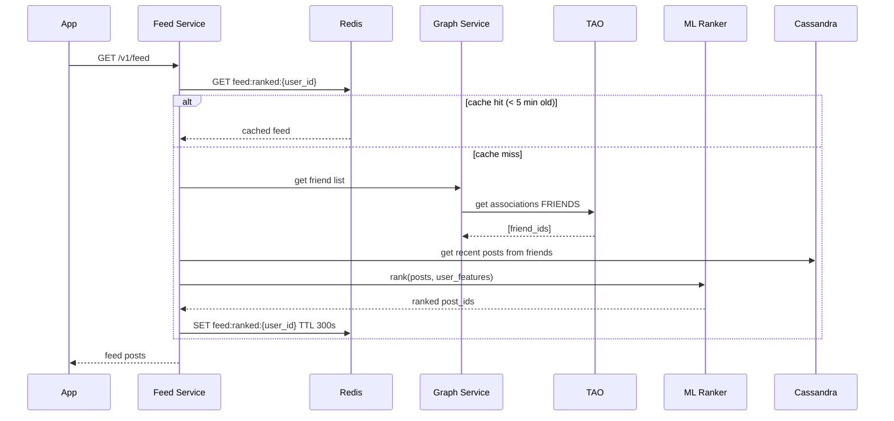
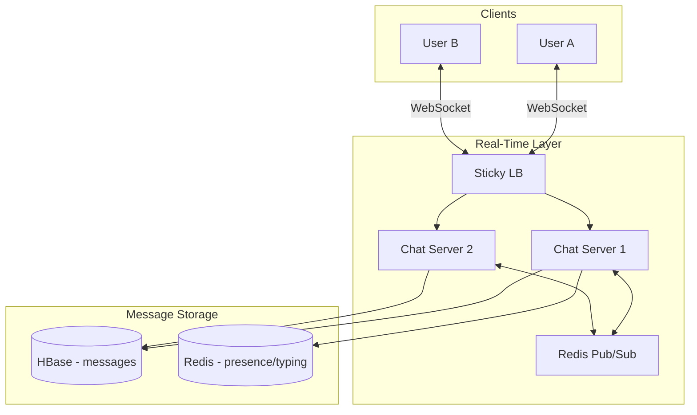
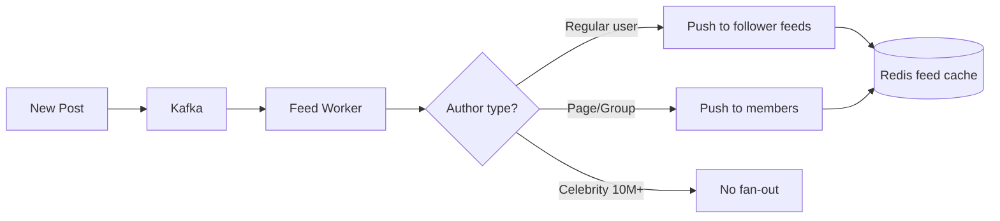
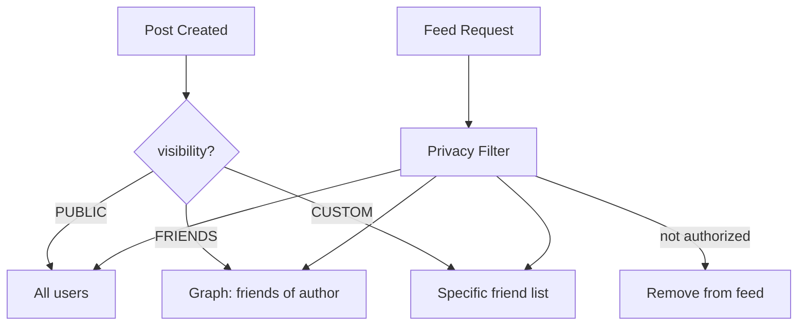

# Facebook — System Design (Detailed)

Complete system design for the world's largest social network — social graph (TAO), ML-ranked news feed, Messenger, Groups at 3B+ user scale.

---

## 1. Requirements & Capacity

| Metric | Estimate |
|--------|----------|
| DAU | 2B |
| Friend connections | ~500B edges |
| Posts/day | 500M |
| Feed reads/day | 100B+ |
| Messages/day | 20B |
| Graph storage | 500B edges × 16B ≈ 8 PB |

---

## 2. High-Level Architecture



---

## 3. Social Graph — TAO Architecture



**TAO stores two entity types:**
```
Objects:      (user_id) → { name, profile_pic, location, ... }
Associations: (user_id) --FRIENDS--> (friend_id)
              (user_id) --MEMBER_OF--> (group_id)
              (user_id) --RSVP--> (event_id)
```

### 3.1 Graph Database Schema (MySQL)

```sql
-- Objects table (entities)
CREATE TABLE objects (
    id          BIGINT PRIMARY KEY,       -- user_id, group_id, etc.
    type        INT NOT NULL,               -- USER=1, GROUP=2, PAGE=3
    data        BLOB,                       -- serialized attributes
    created_at  TIMESTAMP,
    updated_at  TIMESTAMP
);

-- Associations table (edges in graph)
CREATE TABLE associations (
    id1         BIGINT NOT NULL,            -- source node (SHARD KEY)
    atype       INT NOT NULL,               -- FRIENDS=1, MEMBER_OF=2, LIKES=3
    id2         BIGINT NOT NULL,            -- target node
    time        TIMESTAMP DEFAULT NOW(),
    data        BLOB,                       -- edge metadata
    PRIMARY KEY (id1, atype, id2)
);

-- Indexes
CREATE INDEX idx_assoc_id2 ON associations (id2, atype);  -- reverse lookup
CREATE INDEX idx_assoc_time ON associations (id1, atype, time DESC);
```

### 3.2 Graph Indexing Strategy

| Query | Index Used | Complexity |
|-------|-----------|------------|
| Friends of user X | `(id1= X, atype=FRIENDS)` | O(log N + degree) |
| Mutual friends X,Y | Intersect friends(X) ∩ friends(X) | O(d1 + d2) |
| Groups user X belongs to | `(id1=X, atype=MEMBER_OF)` | O(log N + groups) |
| Reverse: who likes post P | `(id2=P, atype=LIKES)` | O(log N) via idx_assoc_id2 |

**Mutual friends query:**
```sql
-- Step 1: get friends of X (from TAO cache)
SELECT id2 FROM associations WHERE id1=X AND atype=FRIENDS;
-- Step 2: get friends of Y
SELECT id2 FROM associations WHERE id1=Y AND atype=FRIENDS;
-- Step 3: intersect in application layer (or bitmap for power users)
```

---

## 4. News Feed — ML Ranking Pipeline



**Feed ranking features (1000+ features):**
```
User features:    age, location, device, time_of_day, past_engagement
Post features:    author relationship, post type, recency, hashtag
Context features: session depth, network speed, battery level
Interaction history: past likes/comments on this author's posts
```

### 4.1 Feed Sequence Diagram



---

## 5. Database Schema — Posts (Cassandra)

```sql
CREATE TABLE posts (
    post_id         UUID,
    author_id       BIGINT,
    content         TEXT,
    media_urls      LIST<TEXT>,
    visibility      INT,        -- PUBLIC=1, FRIENDS=2, CUSTOM=3
    created_at      TIMESTAMP,
    like_count      COUNTER,
    comment_count   INT,
    share_count     INT,
    PRIMARY KEY (author_id, created_at, post_id)
) WITH CLUSTERING ORDER BY (created_at DESC);

CREATE TABLE feed_candidates (
    user_id         BIGINT,
    post_id         UUID,
    author_id       BIGINT,
    score           FLOAT,
    created_at      TIMESTAMP,
    PRIMARY KEY (user_id, score, post_id)
) WITH CLUSTERING ORDER BY (score DESC);
```

---

## 6. Messenger Architecture



**Message schema (HBase):**
```
Row key:  conversation_id + reversed_timestamp
Columns:  sender_id, content, type, read_status, media_url

Example row key: "conv_abc123\xFF\xFF\xFF\xFF\xFF\xFF\xFF\xFF"
(reversed timestamp for newest-first scan)
```

---

## 7. Sharding & Indexing Summary

| Component | Shard Key | Index Type |
|-----------|-----------|-----------|
| MySQL graph | `id1 (user_id)` | B-tree PK + secondary on id2 |
| TAO cache | `id1` | In-memory hash + LRU eviction |
| Cassandra posts | `author_id` | PK clustering by created_at |
| HBase messages | `conversation_id` | Row key prefix scan |
| Redis feed | `user_id` | Sorted set by ML score |
| Elasticsearch | `post_id` | Inverted index for search |

---

## 8. Fan-out Strategy



---

## 9. Privacy Enforcement



---

## 10. Load Balancing

| Layer | Method | Purpose |
|-------|--------|---------|
| DNS | GeoDNS | Route to nearest data center |
| L7 ALB | Least connections | API + GraphQL traffic |
| Chat LB | IP hash (sticky) | WebSocket session persistence |
| TAO | Consistent hash on id1 | Cache locality |
| MySQL | Shard router on user_id | Database queries |

---

## 11. Interview Q&A

**Q: What is TAO and why not Redis?**  
A: TAO is graph-aware — stores associations (edges), not just key-value. One TAO call = "get all friends" vs multiple Redis calls. 99%+ cache hit rate, built for social graph access patterns.

**Q: How is feed different from Instagram?**  
A: Facebook feed is ML-ranked (not chronological). Candidate generation from friends + groups + pages. 1000+ ML features. Instagram is simpler chronological/ranked hybrid.

**Q: How suggest friends?**  
A: Offline Spark jobs nightly: mutual friends (Jaccard similarity), shared groups, contact import (hashed phone numbers), location proximity. ML model ranks candidates. Results cached in TAO.

**Q: How shard 500B graph edges?**  
A: MySQL sharded by id1 (source node). All edges from user X on same shard. Cross-shard queries use TAO scatter-gather with timeout.

**Q: Messenger vs WhatsApp?**  
A: Both use persistent connections. Facebook Messenger: WebSocket + HBase. WhatsApp: custom Erlang + RocksDB. Both guarantee at-least-once delivery with client-side dedup.

**Q: CAP for feed vs payments?**  
A: Feed/likes/notifications: AP. Ad billing/payments: CP with idempotency keys.

[← Back to index](../README.md)
