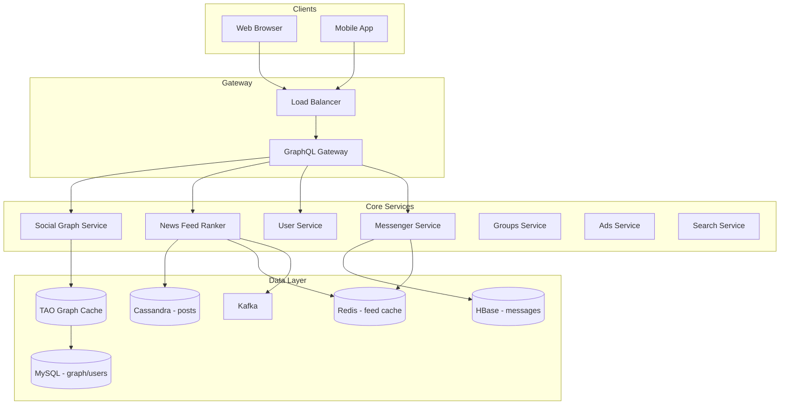

# Facebook — System Design

Design the world's largest social network: friend graph, ranked news feed, Messenger, Groups, Events, and Ads at 3B+ user scale.

---

## Requirements

### Functional
- Friend requests, accept/decline
- News feed (ranked, not chronological)
- Messenger (real-time chat)
- Groups, Pages, Events
- Friend suggestions
- Ads platform

### Non-Functional
- **3B+** users, **500B+** friend connections
- Complex privacy (public / friends / custom)
- Feed ranked by ML — not just time-ordered
- Multi-region deployment
- Messenger latency **< 100ms**

---

## Capacity Estimation

| Metric | Estimate |
|--------|----------|
| DAU | 2B |
| Friend connections | ~500B edges (avg 250 friends × 2B users / 2) |
| Posts/day | 500M |
| Feed reads/day | 100B+ |
| Messages/day | 20B |
| Graph storage | 500B edges × 16B ≈ **8 PB** (MySQL + TAO cache) |

---

## High-Level Architecture



---

## Core Components

### 1. Social Graph — TAO (Facebook's graph cache)

Facebook built **TAO** (The Associations and Objects cache) — a read-optimized graph layer over MySQL.

```
Query: "friends of user 12345"
  → TAO cache hit? return immediately
  → Miss → MySQL (associations table) → populate TAO

Graph stored as:
  objects:     (user_id) → { name, profile_pic, ... }
  associations: (user_id) --FRIENDS--> (friend_id)
                (user_id) --MEMBER_OF--> (group_id)
```

**Why not plain MySQL joins?**  
At 3B users, `JOIN friends ON ...` for feed candidate generation is too slow. TAO pre-materializes graph traversals.

### 2. News Feed — ML Ranking Pipeline

Feed is **not chronological**. Multi-stage ranker:

```
Stage 1 — Candidate Generation:
  - Posts from friends (last 7 days)
  - Posts from groups/pages user follows
  - Recommended posts (ML)
  → ~500 candidates

Stage 2 — ML Ranking:
  - Predict P(like), P(comment), P(share) for each candidate
  - Score = weighted sum of engagement predictions
  → Top 50 ranked

Stage 3 — Filtering:
  - Remove seen posts, apply privacy rules, deduplicate
  → Final 20-30 posts

Stage 4 — Cache:
  - Store ranked feed in Redis (TTL 5 min)
```

### 3. Fan-out (same hybrid as Instagram)

| User type | Strategy |
|-----------|----------|
| Normal user | Push to follower feeds via Kafka workers |
| Celebrity/Page | Pull at read time |
| Group post | Push to all group members |

### 4. Messenger Architecture

Separate from main feed infra:

```
Client ←WebSocket→ Chat Server (sticky session)
                        │
                        ├── Redis Pub/Sub (multi-server relay)
                        ├── HBase (message persistence)
                        └── Push notification service (offline users)

Message flow:
  1. Send → Chat Server → persist HBase → relay to recipient WS
  2. Offline → store + push notification (APNs/FCM)
  3. Delivered/Read receipts via separate lightweight events
```

### 5. Privacy Enforcement

Before any post appears in feed:
```
FOR each candidate post:
  visibility = post.visibility  (PUBLIC | FRIENDS | CUSTOM)
  IF NOT can_view(viewer, author, visibility):
    REMOVE from candidates
```

Checked at Graph Service layer — not optional filter.

---

## Data Model

### MySQL (users, graph — sharded by user_id)

```sql
users (user_id, name, email, created_at)         -- shard by user_id % N

associations (
  id1           BIGINT,    -- user_id (shard key)
  atype         INT,       -- FRIENDS=1, MEMBER_OF=2
  id2           BIGINT,    -- friend_id or group_id
  time          TIMESTAMP,
  data          BLOB       -- extra metadata
)
-- Index: (id1, atype) for "all friends of user X"
```

### Cassandra (posts)

```
posts (
  post_id       UUID,
  author_id     BIGINT,
  content       TEXT,
  visibility    INT,
  created_at    TIMESTAMP,
  PRIMARY KEY (author_id, created_at, post_id)
)
```

### HBase (messages)

```
messages (
  row_key:  conversation_id + timestamp,
  sender_id, content, type, read_status
)
```

---

## API Design (GraphQL)

Facebook mobile uses **GraphQL** — client requests exactly the fields needed:

```graphql
query NewsFeed {
  viewer {
    newsFeed(first: 20) {
      edges {
        node {
          id, message, createdTime
          author { name, profilePicture }
          likes { count }
        }
      }
    }
  }
}
```

REST equivalents:
```
GET  /v1/me/feed?cursor=
GET  /v1/users/{id}/friends
POST /v1/friend-requests
POST /v1/messages
GET  /v1/groups/{id}/feed
```

---

## Scaling Strategies

| Component | Strategy |
|-----------|----------|
| Graph reads | TAO cache — 99%+ hit rate |
| Feed ranking | Pre-compute offline + online rerank |
| Messenger | Dedicated WS cluster, HBase for persistence |
| Friend suggestions | Offline Spark jobs, results cached |
| Ads | Separate ad serving infra, real-time bidding |

---

## Interview Q&A

**Q: How is Facebook different from Instagram?**  
A: Much heavier graph (groups, events, pages), ML ranking layer, TAO graph cache, separate Messenger infra, complex privacy model, ads platform.

**Q: What is TAO and why not use Redis/Memcached?**  
A: TAO is graph-aware — caches associations (edges), not just key-value. Supports "get all friends" in one hop. Built specifically for social graph access patterns.

**Q: How suggest friends?**  
A: Offline batch: mutual friends score, shared groups, contact import hash matching, location overlap. Pre-computed daily, served from cache. ML model ranks suggestions.

**Q: How handle celebrity with 100M followers?**  
A: Pull model for feed fan-out. Rate limit posting. Dedicated cache tier for celebrity content. CDN for profile media.

**Q: Messenger vs WhatsApp architecture?**  
A: Facebook Messenger uses WS + HBase, similar to WhatsApp's Erlang servers + Mnesia/RocksDB. Both prioritize delivery guarantees and offline message queue.

**Q: How shard the social graph?**  
A: MySQL sharded by user_id. Associations for user X live on shard(X). Cross-shard queries (mutual friends) resolved at TAO layer with scatter-gather.

**Q: CAP choice for feed vs payments (Ads billing)?**  
A: Feed/likes: AP (eventual consistency). Ad billing: CP (exact spend tracking, no double-charge).

---

## Tech Stack Summary

| Layer | Technology |
|-------|------------|
| Graph cache | TAO (custom) |
| Database | MySQL (sharded), Cassandra, HBase |
| Feed cache | Redis/Memcached |
| Events | Scribe → Kafka |
| ML ranking | Custom + PyTorch |
| Messenger | C++ chat servers, HBase |
| API | GraphQL (Hack/PHP backend) |

[← Back to index](../README.md)
