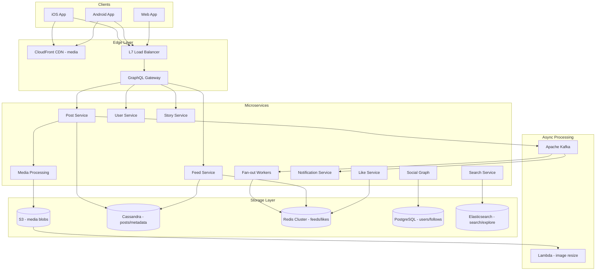
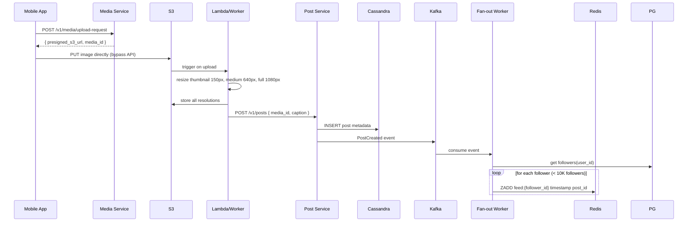
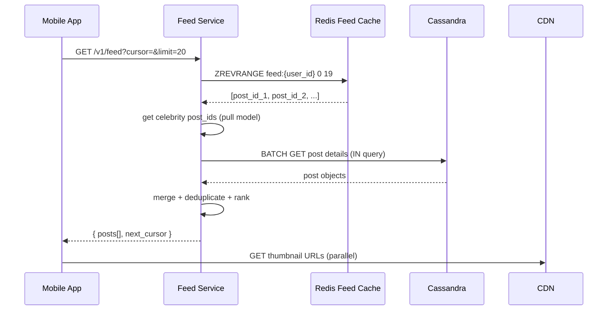
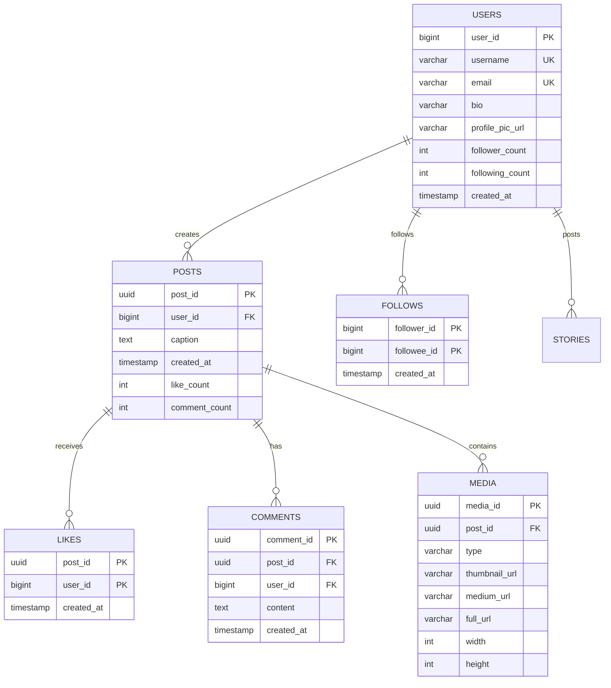
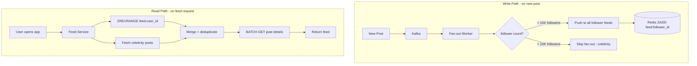
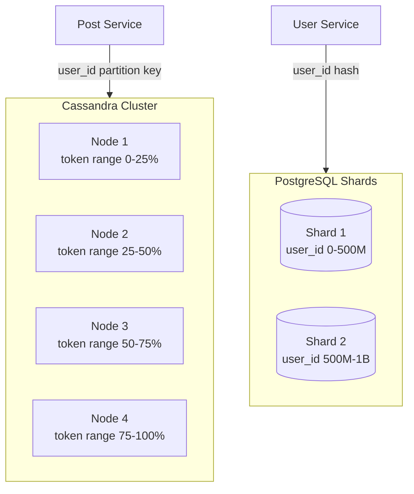
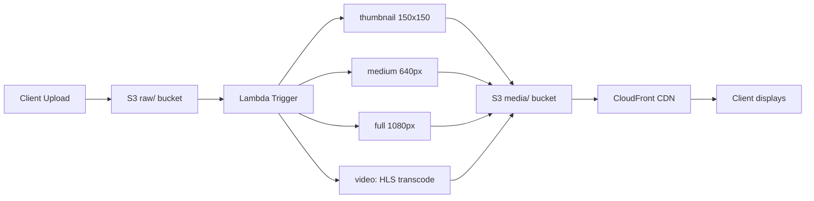
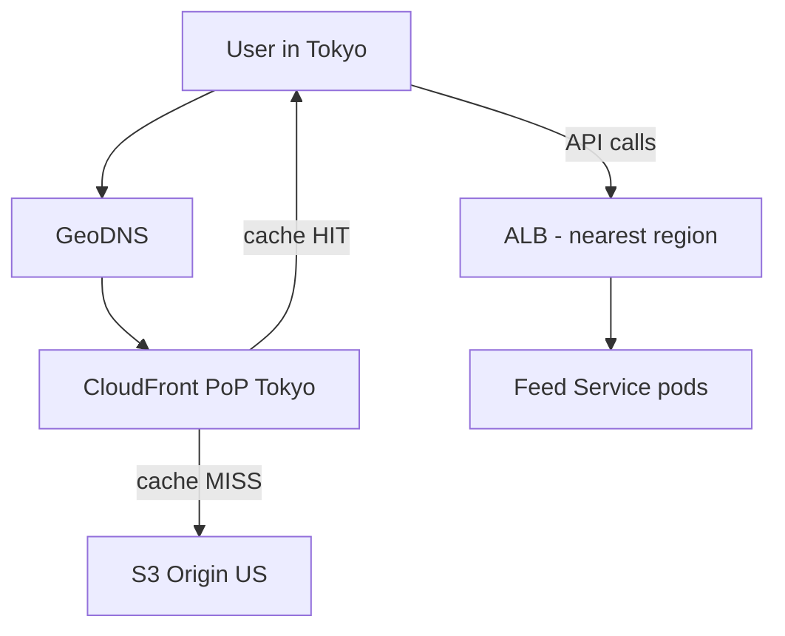
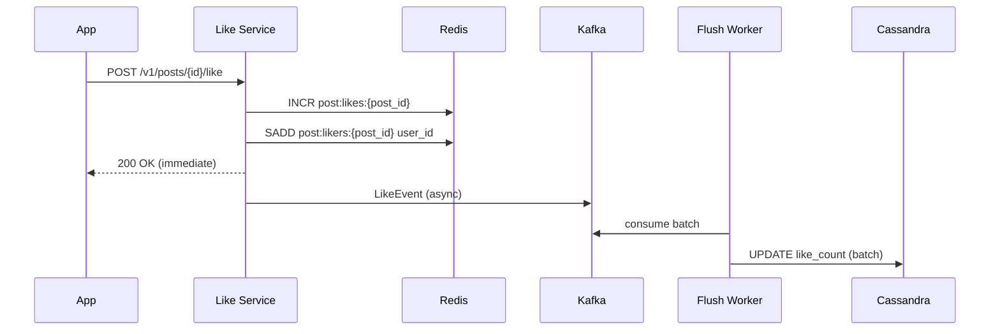

# Instagram — System Design (Detailed)

Complete system design for a photo/video sharing platform at billion-user scale — feed fan-out, media CDN, Cassandra, Redis caching.

---

## 1. Requirements

| Functional | Non-Functional |
|------------|----------------|
| Upload photo/video + caption | Feed load < 500ms |
| Follow/unfollow users | 2B+ users, 100B+ posts |
| Home feed (chronological/ranked) | Read:write ratio 100:1 |
| Stories (24h expiry) | Global CDN for media |
| Like, comment, share | AP consistency for likes OK |
| Direct messages | 99.9% availability |
| Explore/discover page | Multi-region deployment |

---

## 2. Capacity Estimation

```
DAU = 500M
Posts/day = 100M (200M peak on events)
Feed reads/day = 50B (500 reads/user/day)
Peak feed QPS = 50B / 86400 × 3 (peak factor) ≈ 1.7M QPS

Media storage:
  100M posts × 2MB avg = 200TB/day × 365 = 73 PB/year
  Mitigation: CDN caches hot content, delete old resolutions

Metadata (Cassandra):
  100M posts × 500 bytes = 50GB/day × 365 = 18TB/year

Redis (feed cache):
  500M users × 500 post_ids × 8 bytes = 2TB feed cache
  Mitigation: only cache active users (30-day window) ≈ 600GB
```

---

## 3. High-Level Architecture



---

## 4. Sequence Diagrams

### 4.1 Photo Upload Flow



### 4.2 Feed Read Flow



---

## 5. Database Schema (Detailed)

### 5.1 ER Diagram



### 5.2 Cassandra Schema (Posts — Write-Heavy)

```sql
-- Partition by user_id, cluster by created_at DESC
-- Optimized for: "get all posts by user X, newest first"

CREATE TABLE posts_by_user (
    user_id         BIGINT,
    created_at      TIMESTAMP,
    post_id         UUID,
    caption         TEXT,
    media_ids       LIST<UUID>,
    like_count      COUNTER,
    comment_count   INT,
    PRIMARY KEY (user_id, created_at, post_id)
) WITH CLUSTERING ORDER BY (created_at DESC)
  AND compaction = {'class': 'TimeWindowCompactionStrategy'};

-- Lookup by post_id (for feed detail fetch)
CREATE TABLE posts_by_id (
    post_id         UUID PRIMARY KEY,
    user_id         BIGINT,
    caption         TEXT,
    media_ids       LIST<UUID>,
    like_count      INT,
    comment_count   INT,
    created_at      TIMESTAMP
);

-- Likes (high write volume)
CREATE TABLE likes_by_post (
    post_id         UUID,
    user_id         BIGINT,
    created_at      TIMESTAMP,
    PRIMARY KEY (post_id, user_id)
);
```

### 5.3 PostgreSQL Schema (Users & Social Graph)

```sql
CREATE TABLE users (
    user_id         BIGSERIAL PRIMARY KEY,
    username        VARCHAR(30) UNIQUE NOT NULL,
    email           VARCHAR(255) UNIQUE NOT NULL,
    password_hash   VARCHAR(255) NOT NULL,   -- bcrypt, NOT plain SHA
    bio             TEXT,
    profile_pic_url VARCHAR(500),
    follower_count  INT DEFAULT 0,
    following_count INT DEFAULT 0,
    is_private      BOOLEAN DEFAULT FALSE,
    created_at      TIMESTAMP DEFAULT NOW()
);

CREATE TABLE follows (
    follower_id     BIGINT NOT NULL,
    followee_id     BIGINT NOT NULL,
    created_at      TIMESTAMP DEFAULT NOW(),
    PRIMARY KEY (follower_id, followee_id)
);
```

### 5.4 Indexing Strategy

#### PostgreSQL Indexes

| Index | Columns | Type | Query Served |
|-------|---------|------|-------------|
| PK | `user_id` | B-tree | User lookup |
| `idx_users_username` | `username` | B-tree UNIQUE | Login, profile URL |
| `idx_users_email` | `email` | B-tree UNIQUE | Login |
| `idx_follows_followee` | `(followee_id, follower_id)` | B-tree composite | Fan-out worker: get all followers |
| `idx_follows_follower` | `(follower_id, followee_id)` | B-tree composite | "Who does user X follow?" |

**Critical fan-out index:**
```sql
-- Fan-out worker runs this for EVERY new post:
SELECT follower_id FROM follows WHERE followee_id = $author_id;
-- idx_follows_followee makes this O(log N) not full scan
```

#### Cassandra — No Manual Indexes Needed

Cassandra PRIMARY KEY **IS** the index:
```
PRIMARY KEY (user_id, created_at, post_id)
  → partition key: user_id (data co-located)
  → clustering key: created_at DESC (pre-sorted)
  → no secondary index needed for "posts by user"
```

**When to use Cassandra secondary index (avoid if possible):**
```sql
-- BAD: secondary index on post_id across all partitions
CREATE INDEX ON posts_by_user (post_id);  -- scatter-gather, slow

-- GOOD: denormalize into posts_by_id table (write twice, read fast)
INSERT INTO posts_by_user ...;
INSERT INTO posts_by_id ...;
```

#### Redis — Feed Index

```
Key:   feed:{user_id}
Type:  Sorted Set (ZSET)
Score: post created_at timestamp (unix ms)
Member: post_id (UUID string)

Commands:
  ZADD feed:12345 1700000000000 "post-uuid-1"   ← fan-out write
  ZREVRANGE feed:12345 0 19                      ← feed read (top 20)
  ZREMRANGEBYRANK feed:12345 0 -1001             ← trim to 1000 posts max
  ZCARD feed:12345                               ← feed size
```

#### Elasticsearch — Explore/Search Index

```json
{
  "mappings": {
    "posts": {
      "properties": {
        "post_id":       { "type": "keyword" },
        "user_id":       { "type": "long" },
        "caption":       { "type": "text", "analyzer": "standard" },
        "hashtags":      { "type": "keyword" },
        "like_count":    { "type": "integer" },
        "created_at":    { "type": "date" },
        "engagement_score": { "type": "float" }
      }
    }
  }
}
```

---

## 6. Feed Fan-out — Detailed



| User Type | Followers | Write Strategy | Read Strategy |
|-----------|-----------|---------------|---------------|
| Normal user | < 10K | Push to all follower Redis feeds | Read pre-built Redis feed |
| Power user | 10K – 1M | Push (async, may lag seconds) | Read Redis + merge |
| Celebrity | > 1M | **No fan-out** (would write 50M Redis keys) | Pull at read time |

**Celebrity pull at read:**
```python
def get_feed(user_id):
    post_ids = redis.zrevrange(f"feed:{user_id}", 0, 19)
    celebrity_ids = get_celebrity_follows(user_id)
    for celeb_id in celebrity_ids:
        recent = cassandra.get_recent_posts(celeb_id, limit=5)
        post_ids = merge(post_ids, recent)
    return fetch_post_details(post_ids)
```

---

## 7. Sharding Strategy



| Store | Shard Key | Strategy |
|-------|-----------|----------|
| Cassandra posts | `user_id` | Partition key — all user posts on same node |
| PostgreSQL users | `user_id % 2` | Hash sharding across 2+ shards |
| Redis feeds | `user_id` | Redis Cluster hash slot |
| S3 media | `user_id/post_id` | Prefix sharding — no hot partitions |
| Kafka | `user_id` | Partition — ordered events per user |

---

## 8. Media Pipeline



| Resolution | Size | Use Case |
|-----------|------|----------|
| thumbnail | 150×150 | Feed grid, profile grid |
| medium | 640px wide | Feed scroll view |
| full | 1080px wide | Full-screen view |
| HLS video | 360p/720p/1080p | Video posts, Stories |

---

## 9. Load Balancing & CDN



**CDN cache policy:**
```
/media/{post_id}/thumbnail  → Cache 30 days (immutable URL)
/media/{post_id}/full       → Cache 7 days
/v1/feed                    → NO CACHE (personalized)
/v1/users/{id}              → Cache 5 min (public profiles)
```

---

## 10. Like System at Scale



**Why not write Cassandra on every like?**
- 1B likes/day = 11,574 writes/sec to Cassandra
- Redis INCR = 100K+ ops/sec per node
- Batch flush every 30 seconds = 99% reduction in Cassandra writes

---

## 11. Interview Q&A

**Q: Push vs pull fan-out?**  
A: Push: write post_id to follower feeds on post (fast reads). Pull: fetch at read time (for celebrities with millions of followers). Hybrid is industry standard.

**Q: Why Cassandra for posts?**  
A: Write-heavy, time-ordered access pattern, horizontal scale. Partition by user_id = all posts co-located. No joins needed.

**Q: Why not store images in DB?**  
A: DB not designed for blobs. S3 + CDN = cheaper, faster, globally distributed. DB stores URLs only.

**Q: How index feed for fast reads?**  
A: Redis Sorted Set — score=timestamp, member=post_id. O(log N + 20) for top 20 posts. Pre-computed on write.

**Q: How handle 1M QPS feed reads?**  
A: Redis cluster (100K ops/node × 20 nodes). Feed pre-computed. CDN for media. Stateless Feed Service pods auto-scale.

**Q: Consistency model?**  
A: AP for likes (eventual, OK if count off by few). CP for post creation (must not lose posts). Feed may lag 1-2s behind post.

[← Back to index](../README.md)
