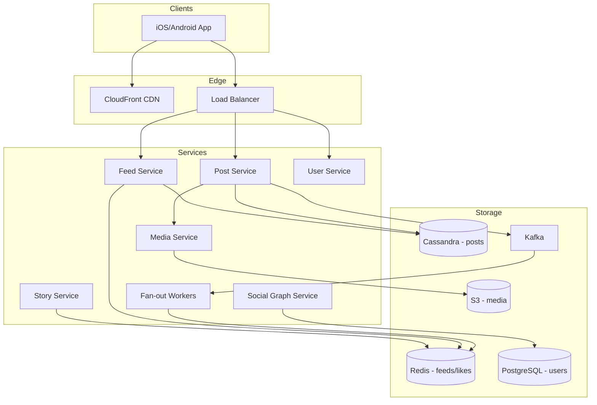

# Instagram — System Design

Design a photo/video sharing platform with home feed, stories, follow graph, likes, and comments at billion-user scale.

---

## Requirements

### Functional
- Upload photo/video with caption
- Follow/unfollow users
- Home feed (posts from people you follow)
- Stories (24-hour expiry)
- Like, comment, direct messages
- Explore/discover page

### Non-Functional
- Feed load **< 500ms**
- **2B+** users, billions of posts
- Read:write ratio **~100:1**
- Global CDN for media delivery
- Eventual consistency OK for likes (AP)

---

## Capacity Estimation

| Metric | Estimate |
|--------|----------|
| DAU | 500M |
| Posts/day | 100M |
| Feed reads/day | 50B (100× writes) |
| Peak feed QPS | ~600,000/s |
| Media storage | 100M posts × 2MB avg × 365 ≈ **73 PB/year** (S3 + CDN) |
| Metadata | 100M/day × 500B × 365 ≈ **18 TB/year** (Cassandra) |

---

## High-Level Architecture



---

## Core Flows

### 1. Media Upload Pipeline

```
1. Client POST /v1/media/upload → pre-signed S3 URL
2. Client uploads directly to S3 (bypasses API servers)
3. S3 trigger → Lambda/Media Service:
   - Generate thumbnail (150px)
   - Generate medium (640px)
   - Generate full (1080px)
   - Extract video frames
4. Store metadata in Cassandra: { post_id, user_id, urls[], caption, created_at }
5. Publish PostCreated event to Kafka
```

### 2. Feed Generation — Hybrid Fan-out

**The core problem:** User follows 500 people. On every feed read, querying 500 timelines = too slow.

| Follower count | Strategy | On write | On read |
|----------------|----------|----------|---------|
| < 10K followers | **Push** (fan-out on write) | Write post_id to each follower's Redis feed | Read pre-built Redis feed |
| > 10K followers (celebrity) | **Pull** (fan-out on read) | Only write to celebrity's own timeline | Merge celebrity posts at read time |

**Push flow:**
```
Post created → Kafka → Fan-out Worker:
  FOR each follower_id in get_followers(user_id):
    IF follower.followee_count < 10000:
      ZADD feed:{follower_id} timestamp post_id
```

**Read flow:**
```
GET /v1/feed:
  1. ZREVRANGE feed:{user_id} 0 19        → top 20 post_ids from Redis
  2. Merge pull-posts from celebrities user follows
  3. Batch GET post details from Cassandra
  4. Return ranked feed
```

### 3. Likes at Scale

```
POST /v1/posts/{id}/like:
  INCR post:likes:{post_id}     → Redis counter (AP)
  SADD post:likers:{post_id} user_id  → optional set
  
Async worker flushes to Cassandra every N seconds
Don't write one DB row per like — 1B likes/day impossible synchronously
```

### 4. Stories (24h TTL)

```
POST /v1/stories → upload media → Redis with TTL 86400s
GET /v1/stories/following → fetch active stories from followed users
Separate from main feed — lightweight, ephemeral
Auto-delete after 24h via Redis TTL or Cassandra TTL
```

---

## Data Model

### Cassandra (posts — write-heavy)

```
posts_by_user (
  user_id       BIGINT,      -- partition key
  created_at    TIMESTAMP,  -- clustering key (DESC)
  post_id       UUID,
  media_urls    LIST<TEXT>,
  caption       TEXT,
  like_count    COUNTER
)

post_details (
  post_id       UUID PRIMARY KEY,
  user_id       BIGINT,
  media_urls    LIST<TEXT>,
  caption       TEXT,
  created_at    TIMESTAMP
)
```

### Redis

```
feed:{user_id}              → Sorted Set (score=timestamp, member=post_id)
post:likes:{post_id}        → Counter
story:{user_id}             → List of story objects, TTL 24h
session:{token}             → User session cache
```

### PostgreSQL (users, follows)

```sql
users (user_id, username, email, bio, profile_pic_url)
follows (follower_id, followee_id, created_at)
-- Index on follower_id for fan-out worker
```

---

## API Design

| Method | Endpoint | Description |
|--------|----------|-------------|
| POST | `/v1/posts` | Create post |
| GET | `/v1/feed?cursor=&limit=20` | Home feed |
| POST | `/v1/posts/{id}/like` | Like post |
| POST | `/v1/posts/{id}/comments` | Add comment |
| POST | `/v1/users/{id}/follow` | Follow user |
| GET | `/v1/users/{id}/posts` | User profile grid |
| POST | `/v1/stories` | Upload story |
| GET | `/v1/stories/following` | Stories tray |

---

## Scaling Strategies

| Bottleneck | Solution |
|------------|----------|
| Feed read (600K QPS) | Redis pre-computed feeds, CDN for media |
| Celebrity post | Pull model — don't fan-out to 100M followers |
| Media storage | S3 + CDN, never serve from origin |
| Like writes | Redis counters, async flush |
| Fan-out worker lag | Kafka consumer groups, scale workers horizontally |

---

## Interview Q&A

**Q: Push vs pull fan-out — when to use which?**  
A: Push for normal users (fast reads). Pull for celebrities (avoid writing to 50M feeds on one post). Hybrid is industry standard.

**Q: How store and serve photos?**  
A: S3 for blobs, CDN for delivery. DB stores URLs only. Pre-generate 3 resolutions on upload. Client picks size based on viewport.

**Q: How handle 1B likes per day?**  
A: Redis INCR counters. Batch persist to Cassandra. Eventual consistency — user sees like count within seconds, not instantly critical.

**Q: Why Cassandra over PostgreSQL for posts?**  
A: Write-heavy, time-series access pattern (posts by user_id ordered by time). Horizontal scale without complex sharding logic.

**Q: How design Explore page?**  
A: Offline ML pipeline ranks posts by engagement + user interests. Pre-computed candidate pools in Redis. Real-time personalization layer on top.

**Q: How shard data?**  
A: Cassandra partitions by user_id. PostgreSQL users sharded by user_id hash. Redis cluster keyed by user_id.

**Q: Consistency model for feed?**  
A: AP — eventual consistency acceptable. New post may take 1-2s to appear in followers' feeds. OK for social media.

---

## Tech Stack Summary

| Layer | Technology |
|-------|------------|
| Media | S3 + CloudFront CDN |
| Posts | Apache Cassandra |
| Feeds/Likes | Redis |
| Users | PostgreSQL |
| Events | Apache Kafka |
| Fan-out | Kafka consumers (Python/Go) |
| API | Python/Go microservices |

[← Back to index](../README.md)
