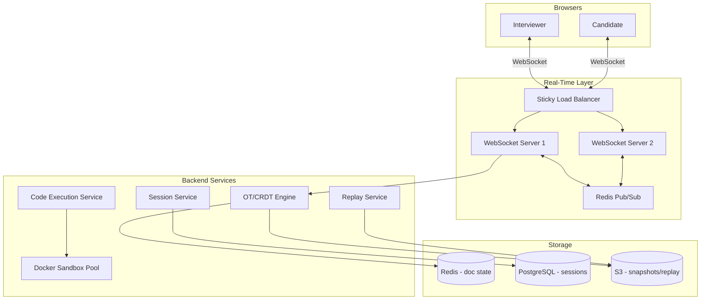

# Real-Time Coding Platform — System Design

Design a collaborative coding interview platform like **CoderPad**, **HackerRank Live**, or **Replit** — shared editor, live sync, sandboxed code execution, optional video.

---

## Requirements

### Functional
- Create coding session (interviewer + candidate)
- Shared code editor with real-time sync
- Run code in sandbox (Python, JS, Java, C++)
- Syntax highlighting, line numbers
- Session replay / playback
- Optional: video/voice chat, chat messages

### Non-Functional
- Edit sync latency **< 100ms**
- Support **2–10** participants per session
- **Secure sandbox** — untrusted code execution
- Session duration: 45–90 minutes typical
- Language support: 10+ languages

---

## Capacity Estimation

| Metric | Estimate |
|--------|----------|
| Concurrent sessions | 50,000 (peak interview hours) |
| WebSocket connections | 100,000 (2 per session) |
| Code runs/session | ~20 runs × 5s each |
| Code run QPS (peak) | 50,000 × 20 / 3600 ≈ **280/s** |
| Storage/session | ~50KB code + 500KB stdout ≈ **550KB** |

---

## High-Level Architecture



---

## Core Flows

### 1. Session Creation

```
POST /v1/sessions
  { language: "python", template: "blank", duration_minutes: 60 }

Response:
  {
    session_id: "abc123",
    ws_url: "wss://code.example.com/v1/sessions/abc123/ws",
    editor_url: "https://code.example.com/abc123",
    invite_token: "xyz789"
  }

Session stored in PostgreSQL: { id, language, created_by, status, created_at }
Initial document state in Redis: { content: template_code, version: 0 }
```

### 2. Real-Time Code Sync (WebSocket + OT)

**Why not send full document on every keystroke?**  
A 1000-line file × 60 keystrokes/min = massive bandwidth. Send **deltas** only.

**Operational Transformation (OT):**
```
User A types "h" at position 0:  Op{ type: INSERT, pos: 0, char: "h" }
User B types "w" at position 0:  Op{ type: INSERT, pos: 0, char: "w" }

OT Engine transforms B's op against A's:
  B's op becomes: INSERT pos: 1, char: "w"  (shifted because A inserted first)

Both clients converge to "wh..." regardless of delivery order
```

**WebSocket message flow:**
```
Client A keystroke
  → WS Server 1
  → OT Engine (apply + transform)
  → Redis Pub/Sub channel:session:abc123
  → WS Server 1 (echo to A)
  → WS Server 2 (relay to B)
  → Client B receives delta, applies locally
```

**Multi-server sync via Redis Pub/Sub:**
```
Channel: session:{session_id}
Message: { op, version, user_id, timestamp }
All WS servers subscribed → relay to their connected clients
```

### 3. Code Execution (Sandboxed)

```
POST /v1/sessions/{id}/run  { language: "python", code: "print('hello')" }

Code Execution Service:
  1. Pull pre-warmed Docker container from pool
  2. Write code to /tmp/main.py inside container
  3. Run: docker exec --network=none --memory=128m --cpus=0.5 \
           --timeout=5s container_id python /tmp/main.py
  4. Capture stdout, stderr, exit code, execution time
  5. Destroy container (never reuse)
  6. Return result via WebSocket to all session participants
```

### 4. Session Replay

```
Every N seconds (or on significant change):
  Snapshot { version, full_content, timestamp } → S3

Replay:
  Load snapshots + op log from S3
  Re-apply ops with timing → reconstruct session timeline
  GET /v1/sessions/{id}/replay → stream of timed events
```

---

## Data Model

### PostgreSQL

```sql
sessions (
  session_id    UUID PRIMARY KEY,
  created_by    BIGINT,
  language      VARCHAR,
  status        ENUM('active','ended'),
  started_at    TIMESTAMP,
  ended_at      TIMESTAMP
)

participants (
  session_id    UUID,
  user_id       BIGINT,
  role          ENUM('interviewer','candidate'),
  joined_at     TIMESTAMP
)

code_runs (
  run_id        UUID PRIMARY KEY,
  session_id    UUID,
  code          TEXT,
  stdout        TEXT,
  stderr        TEXT,
  exit_code     INT,
  duration_ms   INT,
  created_at    TIMESTAMP
)
```

### Redis

```
doc:{session_id}          → { content, version, language }
ops:{session_id}          → List of recent ops (buffer)
presence:{session_id}     → Set of connected user_ids
```

---

## API Design

| Method | Endpoint | Description |
|--------|----------|-------------|
| POST | `/v1/sessions` | Create session |
| GET | `/v1/sessions/{id}` | Session metadata |
| WS | `/v1/sessions/{id}/ws` | Real-time sync |
| POST | `/v1/sessions/{id}/run` | Execute code |
| GET | `/v1/sessions/{id}/replay` | Playback data |
| POST | `/v1/sessions/{id}/join` | Join with invite token |

**WebSocket message types:**
```json
{ "type": "op", "op": { "type": "insert", "pos": 5, "text": "hello" }, "version": 42 }
{ "type": "cursor", "user_id": 1, "pos": 5 }
{ "type": "run_result", "stdout": "...", "stderr": "", "exit_code": 0 }
```

---

## Sandbox Security

| Threat | Mitigation |
|--------|------------|
| Network access (crypto mining, API calls) | `--network=none` |
| File system escape | Read-only root FS, tmpfs for /tmp |
| Resource exhaustion (fork bomb) | `--pids-limit=50`, `--memory=128m`, `--cpus=0.5` |
| Long-running code | `--timeout=5s`, kill container after |
| Container escape | gVisor/Kata Containers (user-space kernel) |
| Code persistence | Destroy container immediately after run |

**Container pool:** Pre-warm N containers per language to reduce cold-start latency (~200ms vs 2s).

---

## Scaling Strategies

| Component | Strategy |
|-----------|----------|
| WebSocket | Sticky LB (IP hash) + Redis Pub/Sub bridge |
| OT Engine | Stateless — state in Redis |
| Code execution | Worker pool, queue (Kafka) if burst exceeds pool |
| Container pool | Pre-warm per language, auto-scale workers |
| Replay storage | S3 — cheap, durable, async writes |

---

## OT vs CRDT

| | OT (Operational Transformation) | CRDT |
|---|--------------------------------|------|
| **Used by** | Google Docs, CoderPad | Figma, Apple Notes |
| **Server role** | Central transformer | Optional (P2P capable) |
| **Complexity** | Hard to implement correctly | Mathematically convergent |
| **Offline** | Needs server to transform | Works offline, syncs later |
| **Interview choice** | OT — simpler with central server | CRDT if P2P needed |

---

## Interview Q&A

**Q: WebSocket vs HTTP polling for code sync?**  
A: WebSocket — full duplex, ~1ms latency, persistent connection. Polling adds 1-5s delay, wastes bandwidth. Unacceptable for live typing.

**Q: How sync edits across multiple WS servers?**  
A: Redis Pub/Sub. Each server publishes ops to session channel. All servers subscribe and relay to their clients. Sticky sessions preferred but Pub/Sub is the bridge.

**Q: How run untrusted code safely?**  
A: Fresh Docker container per run. No network, memory/CPU/time limits, destroyed after. gVisor for extra isolation. Never exec on host.

**Q: OT vs CRDT — which to use?**  
A: OT for central-server architecture (interview platforms). CRDT for offline-first or P2P. OT is industry standard for coding interviews.

**Q: How handle interviewer and candidate typing simultaneously?**  
A: OT transforms concurrent ops so both apply correctly regardless of order. Version numbers detect conflicts.

**Q: How scale to 50K concurrent sessions?**  
A: WS servers are lightweight (~10K connections each). 5-10 WS servers. Redis cluster for state. Separate code execution worker fleet.

**Q: How reduce code run latency?**  
A: Pre-warmed container pool per language. Queue runs if pool exhausted. Target p99 < 3s including execution.

**Q: How implement session replay?**  
A: Store periodic snapshots + op log in S3. Replay re-applies ops with original timestamps. Useful for interview review.

---

## Tech Stack Summary

| Layer | Technology |
|-------|------------|
| Real-time | WebSocket (Node.js/Go) |
| Sync | OT Engine (custom or ShareJS) |
| Pub/Sub | Redis |
| Sessions | PostgreSQL |
| Code execution | Docker / gVisor |
| Replay | S3 |
| Editor frontend | Monaco Editor (VS Code engine) |
| Video (optional) | WebRTC |

[← Back to index](../README.md)
