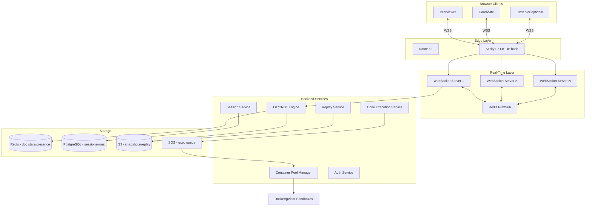
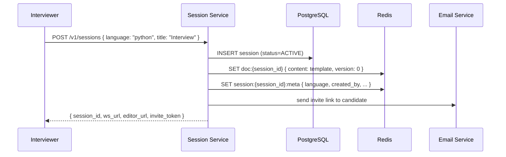
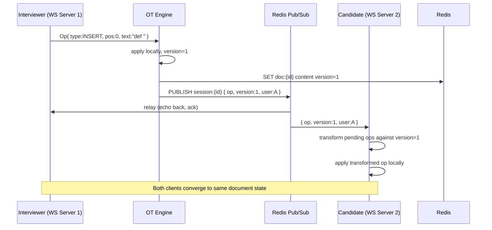
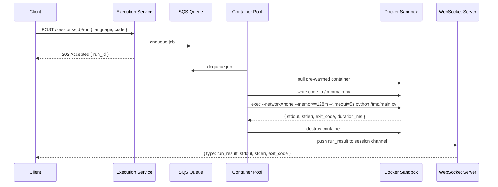
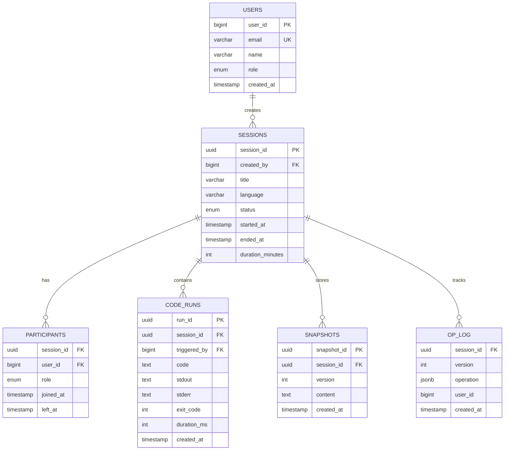
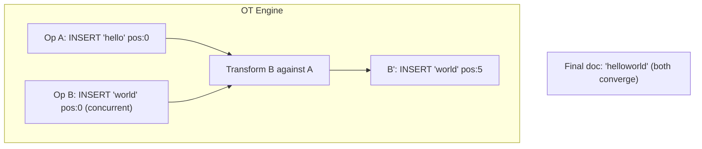
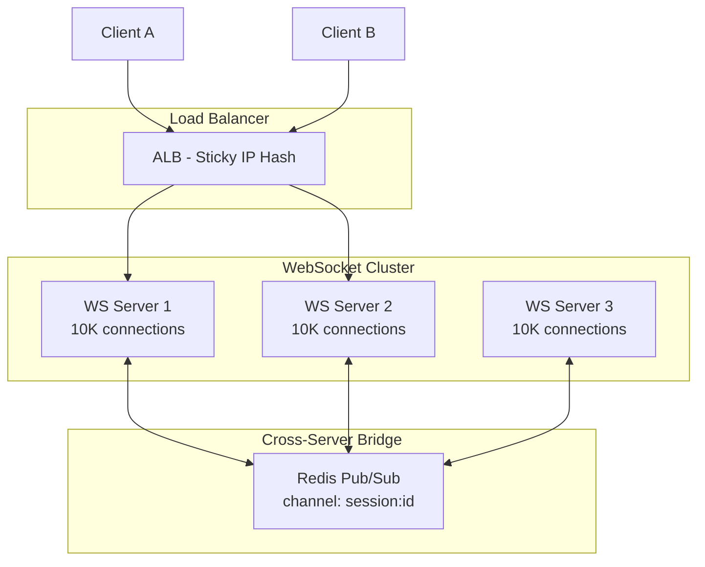
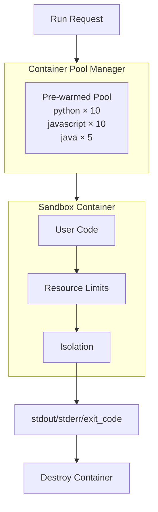
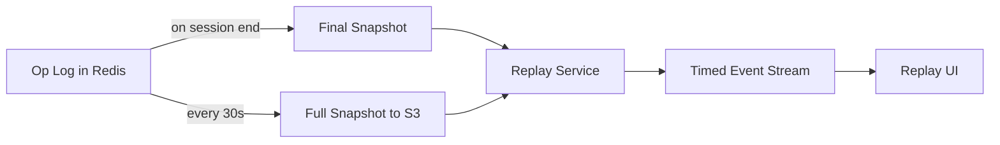

# Real-Time Coding Platform — System Design (Detailed)

Complete system design for CoderPad/HackerRank Live — collaborative editor, WebSocket sync, OT/CRDT, Docker sandbox execution.

---

## 1. Requirements & Capacity

| Metric | Estimate |
|--------|----------|
| Concurrent sessions | 50,000 (peak) |
| WebSocket connections | 100,000 (2 per session) |
| Code runs/session | ~20 × 5s each |
| Peak code execution QPS | ~280/s |
| Edit sync latency target | < 100ms p99 |
| Languages supported | 10+ |

---

## 2. High-Level Architecture



---

## 3. Sequence Diagrams

### 3.1 Session Creation



### 3.2 Real-Time Edit Sync (OT)



### 3.3 Code Execution



---

## 4. Database Schema (Detailed)

### 4.1 ER Diagram



### 4.2 PostgreSQL DDL

```sql
CREATE TABLE sessions (
    session_id      UUID PRIMARY KEY DEFAULT gen_random_uuid(),
    created_by      BIGINT NOT NULL REFERENCES users(user_id),
    title           VARCHAR(200),
    language        VARCHAR(30) NOT NULL DEFAULT 'python',
    template_code   TEXT,
    status          VARCHAR(20) NOT NULL DEFAULT 'active',
    started_at      TIMESTAMP DEFAULT NOW(),
    ended_at        TIMESTAMP,
    settings        JSONB DEFAULT '{}'
);

CREATE TABLE participants (
    session_id      UUID NOT NULL REFERENCES sessions(session_id),
    user_id         BIGINT NOT NULL REFERENCES users(user_id),
    role            VARCHAR(20) NOT NULL,  -- interviewer | candidate | observer
    joined_at       TIMESTAMP DEFAULT NOW(),
    left_at         TIMESTAMP,
    PRIMARY KEY (session_id, user_id)
);

CREATE TABLE code_runs (
    run_id          UUID PRIMARY KEY DEFAULT gen_random_uuid(),
    session_id      UUID NOT NULL REFERENCES sessions(session_id),
    triggered_by    BIGINT NOT NULL,
    code            TEXT NOT NULL,
    language        VARCHAR(30) NOT NULL,
    stdout          TEXT,
    stderr          TEXT,
    exit_code       INT,
    duration_ms     INT,
    memory_used_kb  INT,
    created_at      TIMESTAMP DEFAULT NOW()
);

CREATE TABLE op_log (
    session_id      UUID NOT NULL,
    version         INT NOT NULL,
    operation       JSONB NOT NULL,
    user_id         BIGINT NOT NULL,
    created_at      TIMESTAMP DEFAULT NOW(),
    PRIMARY KEY (session_id, version)
);
```

### 4.3 Indexing Strategy

| Table | Index | Columns | Purpose |
|-------|-------|---------|---------|
| `sessions` | PK | `session_id` | Session lookup |
| `sessions` | `idx_sessions_user` | `(created_by, started_at DESC)` | User's past sessions |
| `sessions` | `idx_sessions_status` | `(status, started_at)` WHERE status='active' | Active sessions monitor |
| `code_runs` | `idx_runs_session` | `(session_id, created_at DESC)` | Run history per session |
| `op_log` | PK | `(session_id, version)` | Ordered op log for replay |
| `participants` | `idx_participants_user` | `(user_id, joined_at DESC)` | User participation history |

**Redis keys:**
| Key | Type | Purpose |
|-----|------|---------|
| `doc:{session_id}` | HASH | `{ content, version, language }` |
| `ops:{session_id}` | LIST | Recent ops buffer (last 1000) |
| `presence:{session_id}` | SET | Connected user_ids |
| `cursor:{session_id}:{user_id}` | STRING | `{ line, col }` cursor position |
| `pubsub:session:{session_id}` | CHANNEL | Real-time op broadcast |

---

## 5. Operational Transformation (OT) — Detailed



**OT operation types:**
```json
{ "type": "insert",  "pos": 5, "text": "hello" }
{ "type": "delete",  "pos": 3, "length": 2 }
{ "type": "retain",  "pos": 0, "length": 5 }
{ "type": "cursor",  "line": 10, "col": 3, "user_id": 1 }
```

**Transform rules (simplified):**
```
INSERT vs INSERT at same pos: later op shifts pos by text length
INSERT vs DELETE: adjust delete range if insert is before
DELETE vs DELETE: merge overlapping ranges
```

**Version tracking:**
```
Client sends: { op, client_version: 5, server_version: 4 }
Server: transform op against ops 4→5, apply, broadcast as version 6
Client: if client_version != server_version → fetch missing ops first
```

---

## 6. WebSocket Scaling



| Challenge | Solution |
|-----------|---------|
| Sticky sessions | ALB IP hash — same client → same WS server |
| Cross-server relay | Redis Pub/Sub per session channel |
| Connection limit | ~10K connections per WS server, scale horizontally |
| Reconnection | Client sends `{ resume_from_version: N }` on reconnect |
| Heartbeat | Ping/pong every 30s, disconnect after 3 missed |

---

## 7. Docker Sandbox — Security



**Docker run command (full security):**
```bash
docker run \
  --rm \                          # destroy after run
  --network=none \                # no network access
  --memory=128m \                 # memory limit
  --memory-swap=128m \            # no swap escape
  --cpus=0.5 \                    # half CPU core
  --pids-limit=50 \               # prevent fork bomb
  --read-only \                   # read-only root FS
  --tmpfs /tmp:size=10M \         # writable temp only
  --user=1000:1000 \              # non-root user
  --security-opt=no-new-privileges \
  -v /code:/app:ro \              # code mounted read-only
  python:3.11-slim \
  timeout 5s python /app/main.py
```

| Threat | Mitigation |
|--------|-----------|
| Network exfiltration | `--network=none` |
| Crypto mining | No network + CPU limit |
| Fork bomb | `--pids-limit=50` |
| File system escape | Read-only root + gVisor |
| Infinite loop | `--timeout=5s` |
| Memory bomb | `--memory=128m` |
| Container escape | gVisor (user-space kernel) |

---

## 8. Sharding & Load Balancing

| Component | Strategy |
|-----------|----------|
| WebSocket servers | Horizontal scale, sticky LB |
| Redis doc state | Hash slot on session_id |
| PostgreSQL | session_id UUID (no shard needed at 50K concurrent) |
| S3 snapshots | Prefix `sessions/{session_id}/` |
| Execution workers | SQS queue — auto-scale workers by queue depth |
| Container pool | Per-language pools, pre-warm based on demand |

---

## 9. Replay System



**Replay API:**
```
GET /v1/sessions/{id}/replay
→ [
    { t: 0,    type: "snapshot", content: "def hello():..." },
    { t: 1500, type: "op", op: { insert, pos: 12, text: "world" }, user: "candidate" },
    { t: 3200, type: "run", stdout: "Hello world", exit_code: 0 },
    ...
  ]
```

---

## 10. API Design (Complete)

| Method | Endpoint | Description |
|--------|----------|-------------|
| POST | `/v1/sessions` | Create session |
| GET | `/v1/sessions/{id}` | Session metadata |
| POST | `/v1/sessions/{id}/join` | Join with invite token |
| WS | `/v1/sessions/{id}/ws` | Real-time sync |
| POST | `/v1/sessions/{id}/run` | Execute code |
| GET | `/v1/sessions/{id}/runs` | Run history |
| GET | `/v1/sessions/{id}/replay` | Replay data |
| DELETE | `/v1/sessions/{id}` | End session |

**WebSocket message types:**
```json
{ "type": "op",       "op": {...}, "version": 42, "user_id": 1 }
{ "type": "cursor",   "line": 5, "col": 10, "user_id": 2 }
{ "type": "presence", "users": [{"id":1,"name":"Interviewer"},{"id":2,"name":"Candidate"}] }
{ "type": "run_result","run_id": "...", "stdout": "...", "stderr": "", "exit_code": 0 }
{ "type": "sync",     "content": "...", "version": 42 }
```

---

## 11. Interview Q&A

**Q: WebSocket vs HTTP polling?**  
A: WebSocket: full-duplex, ~1ms latency, 1 persistent connection. Polling: 1-5s delay, wastes bandwidth. Mandatory for live code sync.

**Q: OT vs CRDT?**  
A: OT: central server transforms ops (Google Docs model). CRDT: mathematically convergent, works P2P/offline (Figma, Apple Notes). OT simpler with central server — standard for interview platforms.

**Q: How sync across multiple WS servers?**  
A: Redis Pub/Sub channel per session. All WS servers subscribe. Op published once, all servers relay to their connected clients.

**Q: How run untrusted code?**  
A: Fresh Docker container per run. No network, CPU/memory/time limits, non-root, read-only FS, destroyed after. gVisor for extra isolation.

**Q: How handle 50K concurrent sessions?**  
A: 5-10 WS servers × 10K connections. Redis cluster for state. Execution workers auto-scale via SQS queue depth. Pre-warmed container pools per language.

**Q: What if client disconnects mid-edit?**  
A: On reconnect: send `{ resume_from_version: N }`. Server sends all ops from version N. Client replays ops locally to catch up.

**Q: How reduce code run cold start?**  
A: Pre-warm container pool (10 python, 10 node, 5 java containers always ready). Pull from pool on run, return to pool or destroy. Cold start: ~200ms vs ~2s.

[← Back to index](../README.md)
