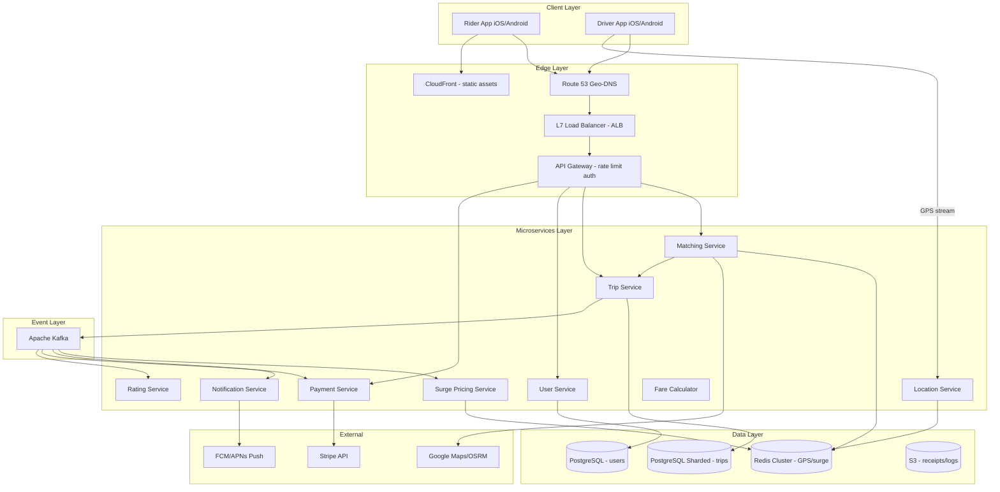
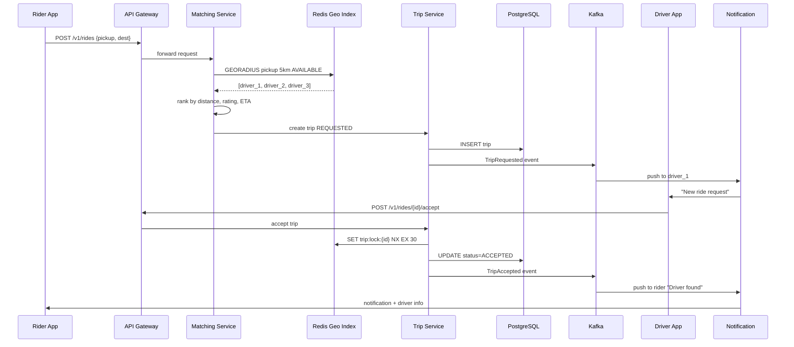
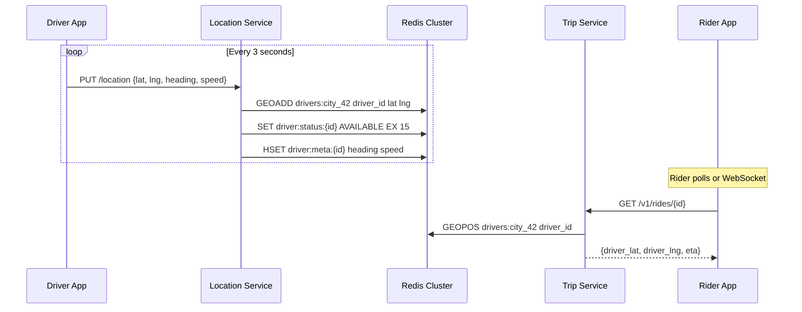
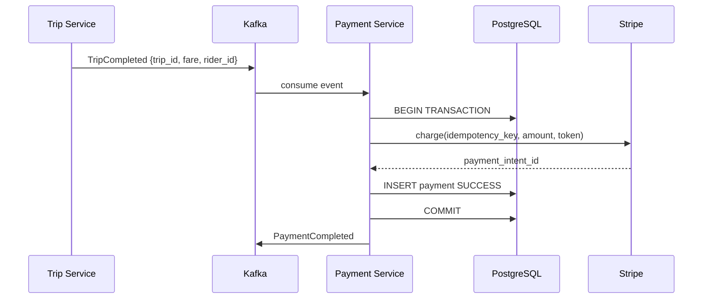
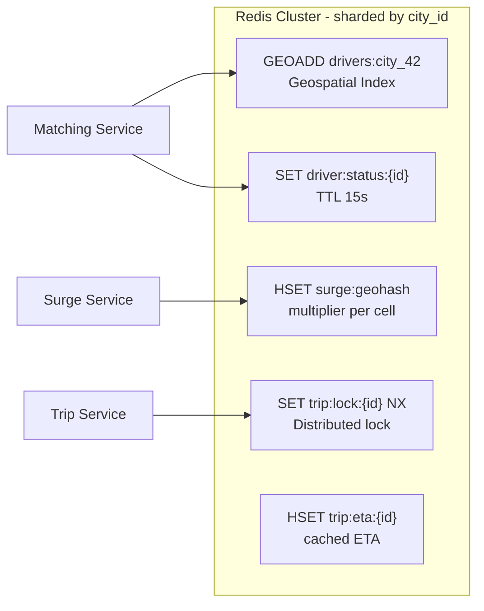
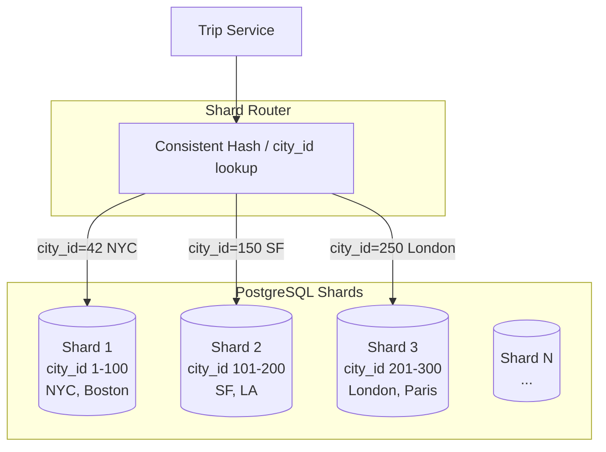
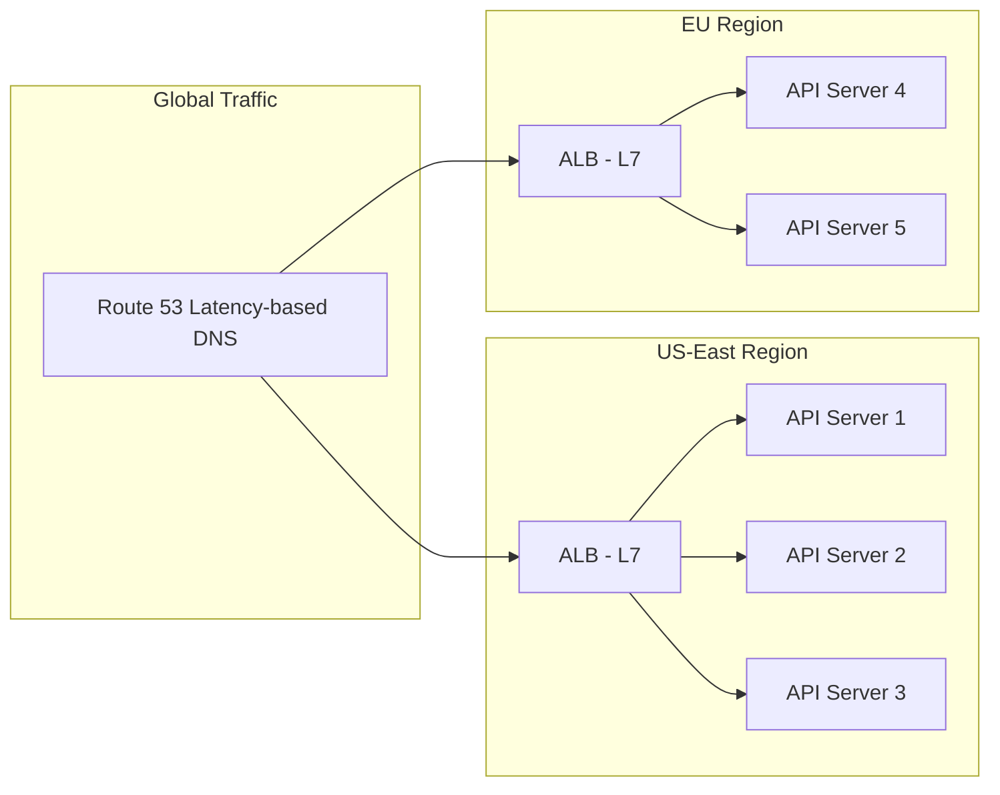
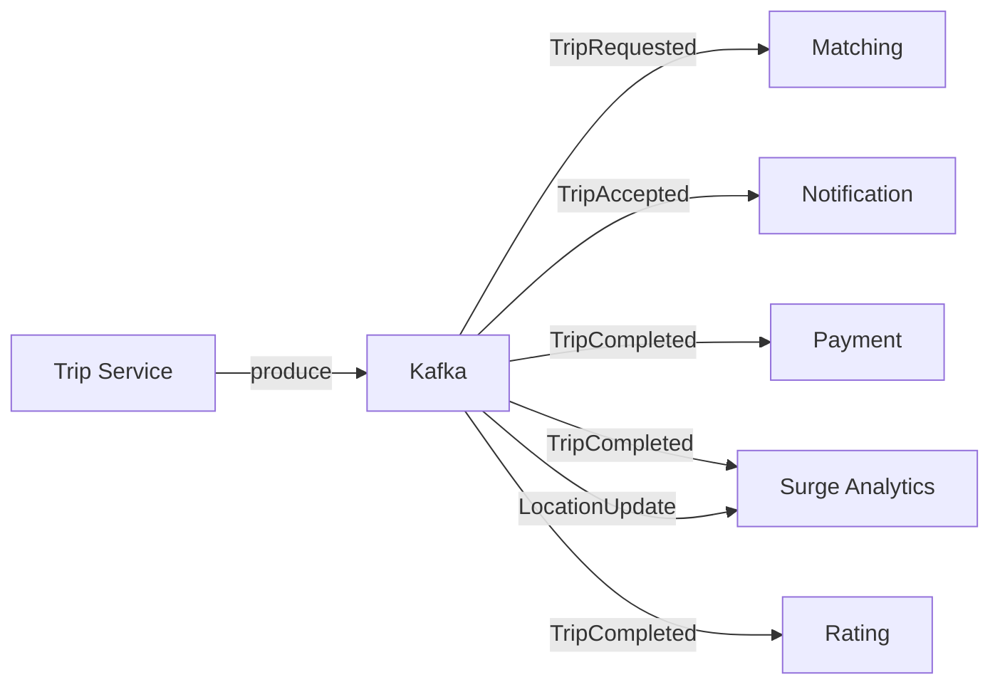
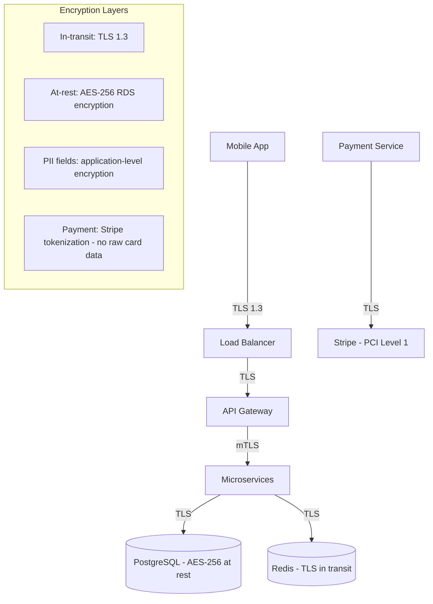
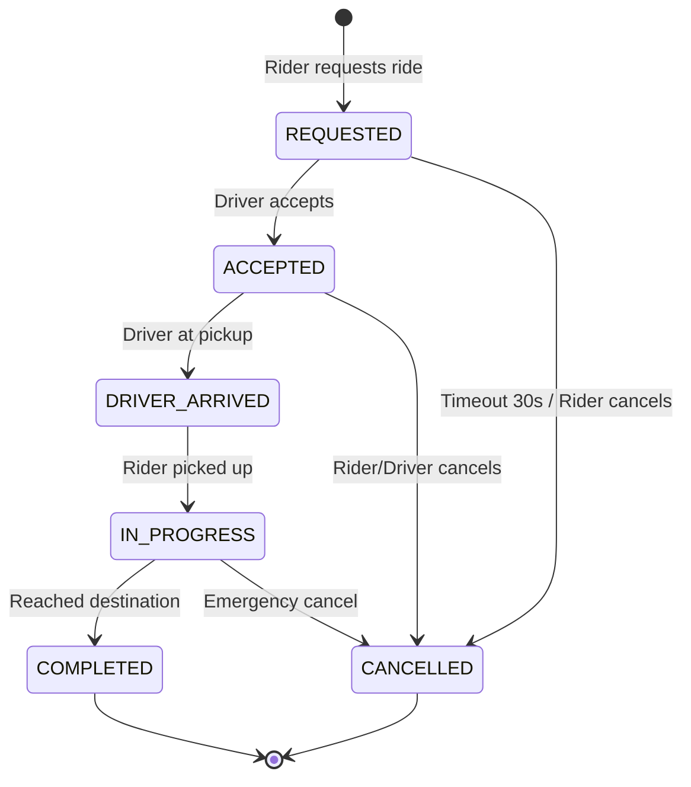

# Uber — System Design (Detailed)

Complete system design for a ride-hailing platform like Uber/Lyft — real-time matching, geospatial indexing, surge pricing, payments.

---

## 1. Requirements

### Functional Requirements
| # | Feature | Details |
|---|---------|---------|
| F1 | Request ride | Pickup + destination lat/lng, vehicle type |
| F2 | Driver matching | Nearest available driver within radius |
| F3 | Live tracking | Driver GPS on map every 3 seconds |
| F4 | Surge pricing | Dynamic multiplier based on demand/supply |
| F5 | Payments | Card/wallet, fare calculation, receipts |
| F6 | Ratings | 1–5 stars post-trip, both directions |
| F7 | Trip history | Past rides for rider and driver |

### Non-Functional Requirements
| # | Requirement | Target |
|---|-------------|--------|
| NF1 | Matching latency | < 1 second |
| NF2 | Location update throughput | 3M writes/sec |
| NF3 | Availability | 99.9% |
| NF4 | Payment consistency | Strong (CP) — no double charge |
| NF5 | Geo partitioning | Per city/region |
| NF6 | Scalability | 100M+ users |

---

## 2. Capacity Estimation

```
Assumptions:
  DAU = 100M, 20% request ride daily = 20M rides/day
  Active drivers = 10M, GPS update every 3 sec
  Peak hour = 3× average traffic

Rides:
  20M / 86400 ≈ 230 rides/sec average
  Peak ≈ 700 rides/sec (matching QPS)

Location updates:
  10M drivers / 3 sec ≈ 3.3M writes/sec  ← hottest path

Storage (trips):
  20M rides × 2KB/ride × 365 days ≈ 14.6 TB/year

Storage (users/drivers):
  100M users × 1KB ≈ 100 GB

Bandwidth (location):
  3M updates × 50 bytes ≈ 150 MB/sec

Redis memory (driver locations):
  10M drivers × 100 bytes ≈ 1 GB per city-shard (manageable)
```

---

## 3. High-Level Architecture



---

## 4. Sequence Diagrams

### 4.1 Ride Request Flow



### 4.2 Driver Location Update Flow



### 4.3 Payment Flow



---

## 5. Database Schema (Detailed)

### 5.1 Entity Relationship Diagram

```mermaid
erDiagram
    USERS ||--o{ TRIPS : requests
    DRIVERS ||--o{ TRIPS : fulfills
    TRIPS ||--|| PAYMENTS : has
    TRIPS ||--o{ RATINGS : receives
    DRIVERS ||--|| DRIVER_PROFILES : has
    CITIES ||--o{ TRIPS : contains

    USERS {
        bigint user_id PK
        varchar email UK
        varchar phone UK
        varchar name
        varchar stripe_customer_id
        timestamp created_at
    }

    DRIVERS {
        bigint driver_id PK
        bigint user_id FK
        varchar license_number
        varchar vehicle_type
        decimal rating_avg
        int total_trips
        enum status
    }

    TRIPS {
        uuid trip_id PK
        bigint rider_id FK
        bigint driver_id FK
        int city_id FK
        decimal pickup_lat
        decimal pickup_lng
        decimal dest_lat
        decimal dest_lng
        enum status
        decimal base_fare
        decimal surge_multiplier
        decimal total_fare
        timestamp requested_at
        timestamp completed_at
    }

    PAYMENTS {
        uuid payment_id PK
        uuid trip_id FK UK
        decimal amount
        enum status
        varchar stripe_intent_id UK
        varchar idempotency_key UK
        timestamp created_at
    }

    RATINGS {
        uuid rating_id PK
        uuid trip_id FK
        bigint rater_id
        bigint ratee_id
        int score
        text comment
    }

    CITIES {
        int city_id PK
        varchar name
        varchar country
        decimal center_lat
        decimal center_lng
    }
```

### 5.2 PostgreSQL DDL — Trips (Sharded by city_id)

```sql
-- Shard key: city_id (trips for NYC on shard 1, London on shard 2)

CREATE TABLE trips (
    trip_id           UUID PRIMARY KEY DEFAULT gen_random_uuid(),
    rider_id          BIGINT NOT NULL,
    driver_id         BIGINT,
    city_id           INT NOT NULL,              -- SHARD KEY
    pickup_lat        DECIMAL(10, 8) NOT NULL,
    pickup_lng        DECIMAL(11, 8) NOT NULL,
    dest_lat          DECIMAL(10, 8) NOT NULL,
    dest_lng          DECIMAL(11, 8) NOT NULL,
    vehicle_type      VARCHAR(20) DEFAULT 'standard',
    status            VARCHAR(20) NOT NULL DEFAULT 'REQUESTED',
    -- REQUESTED | ACCEPTED | DRIVER_ARRIVED | IN_PROGRESS | COMPLETED | CANCELLED
    base_fare         DECIMAL(10, 2),
    surge_multiplier  DECIMAL(4, 2) DEFAULT 1.0,
    total_fare        DECIMAL(10, 2),
    distance_km       DECIMAL(8, 2),
    duration_min      INT,
    requested_at      TIMESTAMP NOT NULL DEFAULT NOW(),
    accepted_at       TIMESTAMP,
    started_at        TIMESTAMP,
    completed_at      TIMESTAMP,
    cancelled_at      TIMESTAMP,
    cancel_reason     VARCHAR(100)
);

CREATE TABLE payments (
    payment_id        UUID PRIMARY KEY DEFAULT gen_random_uuid(),
    trip_id           UUID NOT NULL UNIQUE REFERENCES trips(trip_id),
    amount            DECIMAL(10, 2) NOT NULL,
    currency          VARCHAR(3) DEFAULT 'USD',
    status            VARCHAR(20) NOT NULL,    -- PENDING | SUCCESS | FAILED | REFUNDED
    stripe_intent_id  VARCHAR(100) UNIQUE,
    idempotency_key   VARCHAR(100) UNIQUE NOT NULL,
    created_at        TIMESTAMP DEFAULT NOW(),
    updated_at        TIMESTAMP DEFAULT NOW()
);
```

### 5.3 Indexing Strategy — PostgreSQL

| Table | Index Name | Columns | Type | Purpose |
|-------|-----------|---------|------|---------|
| `trips` | PK | `trip_id` | B-tree | Primary lookup |
| `trips` | `idx_trips_rider_history` | `(rider_id, requested_at DESC)` | B-tree composite | Rider trip history page |
| `trips` | `idx_trips_driver_history` | `(driver_id, requested_at DESC)` | B-tree composite | Driver earnings history |
| `trips` | `idx_trips_city_status` | `(city_id, status, requested_at)` | B-tree composite | Active trips per city (support dashboard) |
| `trips` | `idx_trips_status` | `(status)` WHERE status IN ('REQUESTED','ACCEPTED') | Partial index | Matching service — only active trips |
| `payments` | `idx_payments_trip` | `(trip_id)` | B-tree | Payment lookup by trip |
| `payments` | `idx_payments_idempotency` | `(idempotency_key)` | B-tree UNIQUE | Prevent double charge |
| `users` | `idx_users_email` | `(email)` | B-tree UNIQUE | Login |
| `drivers` | `idx_drivers_rating` | `(rating_avg DESC)` | B-tree | Ranking in matching |

**Why composite index `(rider_id, requested_at DESC)`?**
```sql
-- Covers this query without sorting:
SELECT * FROM trips
WHERE rider_id = 12345
ORDER BY requested_at DESC
LIMIT 20;
-- Index scan only — no filesort
```

**Partial index for active trips:**
```sql
CREATE INDEX idx_trips_active ON trips (city_id, requested_at)
WHERE status IN ('REQUESTED', 'ACCEPTED', 'IN_PROGRESS');
-- Smaller index — excludes millions of COMPLETED rows
```

### 5.4 Redis Data Structures & Indexing



| Redis Key | Type | TTL | Purpose |
|-----------|------|-----|---------|
| `drivers:geo:{city_id}` | GEO (Sorted Set) | — | Geospatial index of active drivers |
| `driver:status:{driver_id}` | STRING | 15s | AVAILABLE / BUSY / OFFLINE |
| `driver:meta:{driver_id}` | HASH | 15s | heading, speed, vehicle_type |
| `surge:{geohash_6}` | STRING | 5min | Surge multiplier (e.g. 1.5) |
| `trip:lock:{trip_id}` | STRING | 30s | Distributed lock for accept |
| `demand:{geohash_6}` | COUNTER | 10min | Ride requests in cell (surge input) |
| `supply:{geohash_6}` | COUNTER | 10min | Available drivers in cell |

**Geospatial indexing commands:**
```redis
# Driver sends location
GEOADD drivers:geo:42 "driver_123" -73.9857 40.7484

# Find drivers within 5km of pickup
GEORADIUS drivers:geo:42 -73.9857 40.7484 5 km WITHDIST WITHCOORD ASC COUNT 10

# Get specific driver position
GEOPOS drivers:geo:42 "driver_123"
```

**Geohash for surge cells:**
```
lat=40.7484, lng=-73.9857 → geohash "dr5regy" (precision 6 ≈ 1.2km × 0.6km cell)
Surge calculated per geohash cell, not per exact coordinate
```

---

## 6. Sharding Strategy



| Data | Shard Key | Reason |
|------|-----------|--------|
| Trips | `city_id` | 99% queries scoped to city (support, surge, analytics) |
| Users | `user_id % N` | Global account, not city-specific |
| Driver locations | `city_id` | Redis cluster slot by city |
| Kafka topics | `city_id` partition | Ordered events per city |

**Cross-shard trip (rare):** Rider in city A, driver from city B — store on pickup city shard, replicate metadata to driver shard async.

---

## 7. Load Balancing



| Layer | Component | Algorithm | Purpose |
|-------|-----------|-----------|---------|
| DNS | Route 53 | Latency-based routing | Send user to nearest region |
| L7 | AWS ALB | Least outstanding requests | Distribute API traffic |
| Location | Dedicated LB | Consistent hash on driver_id | Sticky location stream to same Location Service pod |
| Redis | Redis Cluster | Hash slot | 16384 slots across Redis nodes |

**Health checks:**
```
ALB → GET /health every 10s
  Response: { "status": "ok", "redis": "connected", "pg": "connected" }
  Unhealthy threshold: 2 consecutive failures → remove from pool
```

---

## 8. Kafka Event Design



| Topic | Partition Key | Consumers | Retention |
|-------|--------------|-----------|-----------|
| `trip.events` | `trip_id` | Payment, Notify, Analytics | 7 days |
| `location.updates` | `city_id` | Surge Service | 1 hour |
| `payment.events` | `trip_id` | Billing, Receipt | 30 days |
| `notification.commands` | `user_id` | Push Service | 1 day |

---

## 9. API Design (Complete)

| Method | Endpoint | Auth | Request Body | Response |
|--------|----------|------|-------------|----------|
| POST | `/v1/rides` | Rider | `{pickup_lat, pickup_lng, dest_lat, dest_lng, vehicle_type}` | `{trip_id, status, surge_multiplier, estimated_fare}` |
| GET | `/v1/rides/{id}` | Rider/Driver | — | `{trip, driver_location, eta}` |
| POST | `/v1/rides/{id}/accept` | Driver | — | `{trip_id, status: ACCEPTED}` |
| POST | `/v1/rides/{id}/cancel` | Rider/Driver | `{reason}` | `{status: CANCELLED, cancellation_fee}` |
| PUT | `/v1/drivers/location` | Driver | `{lat, lng, heading, speed}` | `204 No Content` |
| PUT | `/v1/drivers/status` | Driver | `{status: AVAILABLE\|OFFLINE}` | `204` |
| GET | `/v1/surge` | Rider | `?lat=&lng=` | `{multiplier, expires_at}` |
| POST | `/v1/rides/{id}/rate` | Rider/Driver | `{score, comment}` | `{rating_id}` |
| GET | `/v1/users/me/trips` | Rider | `?cursor=&limit=20` | `{trips[], next_cursor}` |

**Rate limits (Redis token bucket):**
```
POST /v1/rides        → 10/min per rider
PUT  /v1/drivers/location → 1/sec per driver (enforced server-side)
GET  /v1/rides/{id}   → 60/min per user
```

---

## 10. Security & Encryption



| Data | Protection |
|------|-----------|
| API traffic | TLS 1.3 |
| Database | AES-256 at rest (RDS encryption) |
| PII (email, phone) | Application-level AES-256 + KMS |
| Payment cards | Stripe tokenization — never store CVV/PAN |
| Location data | Encrypted in transit, 90-day retention policy |
| Auth tokens | JWT RS256, 15min expiry, refresh token rotation |

---

## 11. Trip State Machine



---

## 12. Interview Q&A

**Q: How find nearby drivers in < 1 second?**  
A: Redis `GEORADIUS` on geospatial sorted set — O(log N + M). Pre-filter by city shard. Rank top 10 in memory. No PostgreSQL involved in hot path.

**Q: How handle 3M location writes/sec?**  
A: Dedicated Location Service cluster. Redis cluster sharded by city. Batch writes where possible. Location data is ephemeral — no DB persistence needed.

**Q: How prevent double-accept of same ride?**  
A: `SET trip:lock:{id} NX EX 30` in Redis — atomic, only first driver wins. DB unique partial index on `(trip_id) WHERE status='ACCEPTED'`.

**Q: Why shard trips by city_id?**  
A: Locality — support teams, surge pricing, city regulations, analytics all city-scoped. Avoids cross-shard queries for 99% of access patterns.

**Q: How calculate surge pricing?**  
A: `multiplier = 1 + alpha × (demand - supply) / supply` per geohash cell. Demand = ride requests in 10min window. Supply = available drivers. Cached in Redis, recalculated every 2 min.

**Q: CP or AP for payments?**  
A: CP — PostgreSQL transaction + Stripe idempotency key. Never charge twice even on retry.

**Q: How estimate ETA?**  
A: OSRM/Google Maps routing API + ML model trained on historical trip times for (origin, dest, time_of_day). Cache popular routes in Redis (TTL 1h).

[← Back to index](../README.md)
