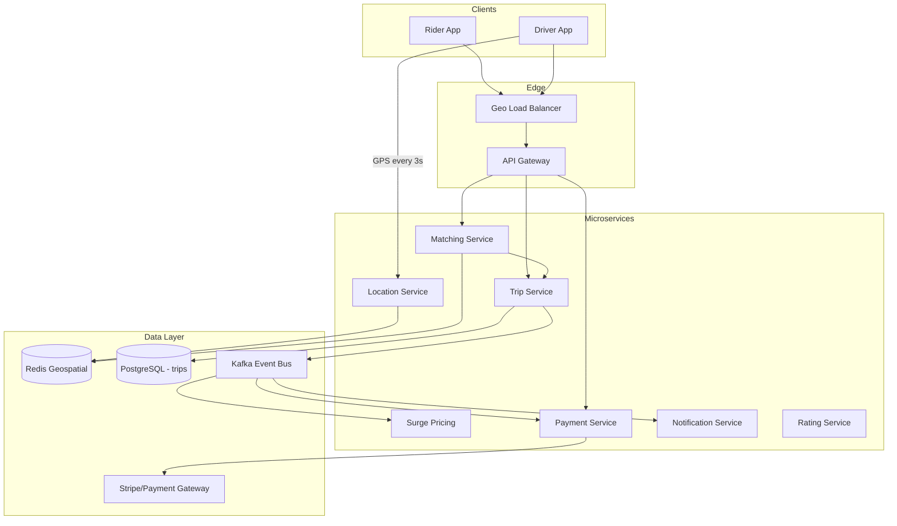

# Uber — System Design

Design a ride-hailing platform: match riders with nearby drivers in real time, handle trips, surge pricing, and payments.

---

## Requirements

### Functional
- Rider requests ride (pickup + destination)
- Match with nearest available driver
- Real-time driver tracking on map
- Surge pricing during high demand
- Payments, ratings, trip history
- Driver accepts/rejects ride

### Non-Functional
- Matching latency **< 1 second**
- **100M+** users, millions of concurrent trips
- **99.9%** availability
- Geo-partitioned by city/region
- Strong consistency for payments (CP)

---

## Capacity Estimation

| Metric | Estimate |
|--------|----------|
| DAU | 100M |
| Rides/day | 20M |
| Peak QPS (ride requests) | ~5,000/s |
| Location updates | 10M drivers × 1 update/3s ≈ **3M writes/s** |
| Trip storage | 20M/day × 365 × 2KB ≈ **14 TB/year** |
| Location data | Ephemeral — Redis only, not persisted long-term |

---

## High-Level Architecture



---

## Core Flows

### 1. Driver Location Updates (hottest path)

```
Driver App ──every 3s──► PUT /v1/drivers/location { lat, lng, heading }
                              │
                              ▼
                     Location Service
                              │
                              ▼
              Redis GEOADD drivers:city_42 driver_id lat lng
              TTL 15 seconds (auto-expire if offline)
```

**Why Redis Geospatial?**
- `GEORADIUS drivers:city_42 lat lng 5 km` → returns nearby drivers in O(log N)
- Alternative: Geohash in Cassandra/DynamoDB for persistence

### 2. Ride Request & Matching

```
1. Rider POST /v1/rides { pickup, destination }
2. Matching Service:
   a. GEORADIUS → candidate drivers within 5 km
   b. Filter: available, right vehicle type, high rating
   c. Rank by: distance, acceptance rate, ETA
   d. Send request to top 3 drivers (sequential or broadcast)
3. Driver POST /v1/rides/{id}/accept
4. Distributed lock (Redis Redlock) → prevent double-accept
5. Trip state → ACCEPTED, notify rider via push (Kafka → Notify)
```

### 3. Trip State Machine

```
REQUESTED → ACCEPTED → DRIVER_ARRIVED → IN_PROGRESS → COMPLETED
                ↓           ↓              ↓
            CANCELLED   CANCELLED      CANCELLED
```

Each transition → PostgreSQL update + Kafka event → billing, analytics, notifications.

### 4. Surge Pricing

```
Surge Service consumes Kafka:
  - ride requests per geo-cell (demand)
  - available drivers per geo-cell (supply)
  
multiplier = f(demand / supply)   → cached in Redis per cell
Rider sees surge before confirming ride
```

---

## Data Model

### PostgreSQL (trips, payments)

```sql
trips (
  trip_id       UUID PRIMARY KEY,
  rider_id      BIGINT,
  driver_id     BIGINT,
  city_id       INT,           -- shard key
  pickup_lat    DECIMAL,
  pickup_lng    DECIMAL,
  dest_lat      DECIMAL,
  dest_lng      DECIMAL,
  status        ENUM,
  fare          DECIMAL,
  surge_mult    DECIMAL,
  created_at    TIMESTAMP
)

payments (
  payment_id    UUID PRIMARY KEY,
  trip_id       UUID REFERENCES trips,
  amount        DECIMAL,
  status        ENUM,
  stripe_id     VARCHAR
)
```

**Sharding:** `city_id` — trips for NYC on shard 1, SF on shard 2.

### Redis (ephemeral)

```
drivers:geo:{city_id}     → GEOADD driver locations
driver:status:{id}        → AVAILABLE | BUSY | OFFLINE
surge:{geohash}           → 1.5 (multiplier)
trip:lock:{trip_id}       → distributed lock TTL 30s
```

---

## API Design

| Method | Endpoint | Description |
|--------|----------|-------------|
| POST | `/v1/rides` | Request ride |
| GET | `/v1/rides/{id}` | Trip status + driver location |
| POST | `/v1/rides/{id}/accept` | Driver accepts |
| POST | `/v1/rides/{id}/cancel` | Cancel trip |
| PUT | `/v1/drivers/location` | Update GPS (every 3s) |
| PUT | `/v1/drivers/status` | AVAILABLE / OFFLINE |
| GET | `/v1/surge?lat=&lng=` | Surge multiplier |
| POST | `/v1/rides/{id}/rate` | Rate driver/rider |

**Idempotency:** `Idempotency-Key` header on POST /rides and payment calls.

---

## Scaling Strategies

| Component | Strategy |
|-----------|----------|
| Location writes | Redis cluster sharded by city, write batching |
| Matching | Stateless service, scale horizontally |
| Trips DB | Shard by city_id, read replicas for history |
| Kafka | Partition by city_id |
| Notifications | Async via Kafka — decouple from critical path |

---

## Security & Encryption

- **TLS 1.3** for all API traffic
- **PCI-DSS:** card data tokenized via Stripe — never store CVV
- **PII encryption** at rest (AES-256) for rider/driver personal data
- **Location privacy:** fuzzy location shown until driver assigned

---

## Interview Q&A

**Q: How find nearby drivers in under 1 second?**  
A: Redis `GEORADIUS` on geospatial index. Pre-filter by city shard. Rank top candidates in memory. No DB scan.

**Q: What if driver goes offline during matching?**  
A: 15s TTL on location keys. Matching checks `driver:status`. If accept timeout (30s), offer ride to next driver.

**Q: How prevent two drivers accepting same ride?**  
A: Redis distributed lock on `trip:lock:{id}`. Only first `SET NX` wins. DB unique constraint on `(trip_id, status=ACCEPTED)`.

**Q: Why Kafka for trip events?**  
A: Decouple trip service from notifications, billing, surge, analytics. Replay events for debugging. Handle traffic spikes.

**Q: How shard trip data?**  
A: By `city_id` — most queries are city-scoped (support, analytics, local regulations). Cross-city trips rare.

**Q: SQL or NoSQL for trips?**  
A: PostgreSQL — ACID required for payments and state transitions. Redis for ephemeral location only.

**Q: How estimate ETA?**  
A: Routing API (Google/OSRM) + historical traffic ML model. Cache common routes in Redis.

**Q: Multi-region strategy?**  
A: Geo-routed LB sends user to nearest region. Each city operates independently. Cross-region only for account/profile data.

---

## Tech Stack Summary

| Layer | Technology |
|-------|------------|
| API | Go/Java microservices |
| Location | Redis Geospatial |
| Trips/Payments | PostgreSQL (sharded) |
| Events | Apache Kafka |
| Cache | Redis |
| LB | AWS ALB (L7) + geo routing |
| Payments | Stripe |
| Maps | Google Maps / OSRM |

[← Back to index](../README.md)
