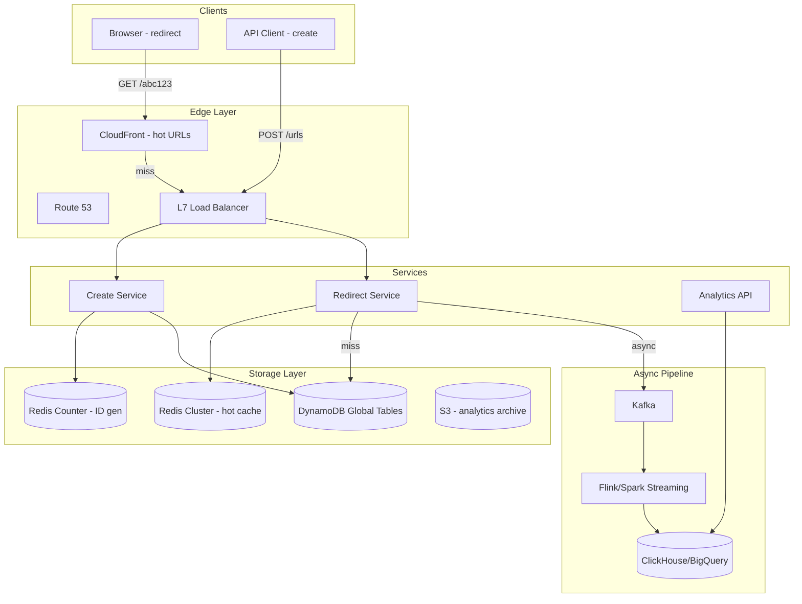
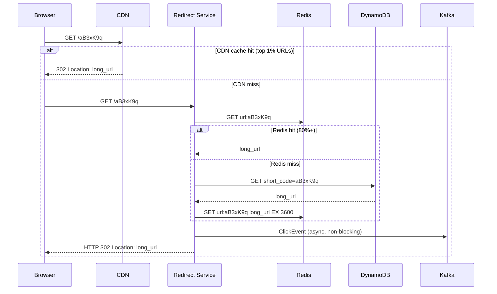
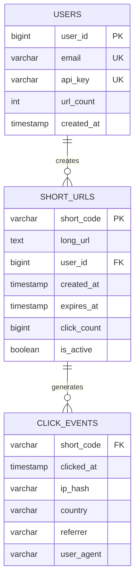
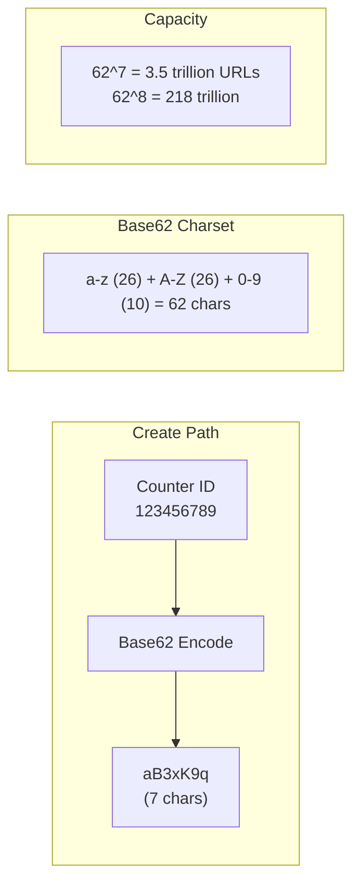
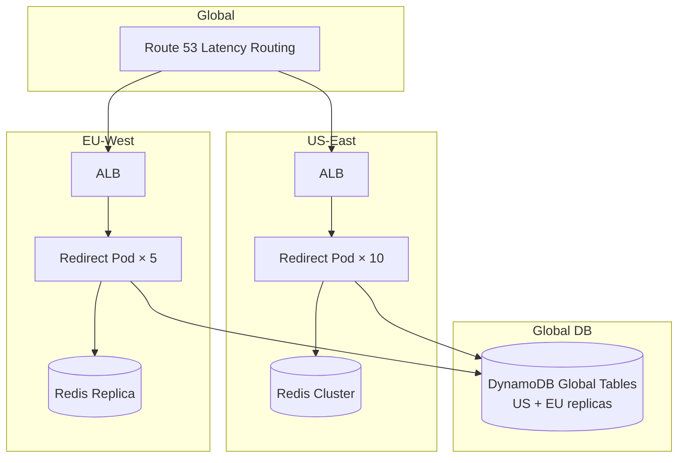
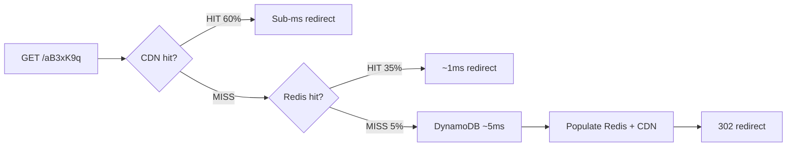

# URL Shortener — System Design (Detailed)

Complete system design for bit.ly/TinyURL — Base62 encoding, sub-millisecond redirects, analytics at 100:1 read:write ratio.

---

## 1. Requirements & Capacity

| Metric | Estimate |
|--------|----------|
| New URLs/day | 100M |
| Redirects/day | 10B (100:1 ratio) |
| Peak redirect QPS | ~120,000/s |
| Total URLs stored | 100M+ |
| Storage | 100M × 500B ≈ 50 GB |
| Analytics events/day | 10B (async, not on hot path) |

---

## 2. High-Level Architecture



---

## 3. Sequence Diagrams

### 3.1 Create Short URL

```mermaid
sequenceDiagram
    participant Client
    participant Create as Create Service
    participant Counter as Redis Counter
    participant DB as DynamoDB
    participant Cache as Redis Cache

    Client->>Create: POST /v1/urls { long_url, custom_alias?, expires_at? }
    Create->>Create: validate URL (not malware, reachable)
    alt custom alias provided
        Create->>DB: conditional put (alias must not exist)
        DB-->>Create: success / ConditionalCheckFailed
    else auto-generate
        Create->>Counter: INCR global:url_counter
        Counter-->>Create: id = 123456789
        Create->>Create: code = base62(id) = "aB3xK9q"
        Create->>DB: put(short_code, long_url, metadata)
    end
    Create->>Cache: SET url:{code} long_url EX 3600
    Create-->>Client: { short_url: "https://abc.ly/aB3xK9q", code, expires_at }
```

### 3.2 Redirect (Hot Path)



---

## 4. Database Schema (Detailed)

### 4.1 DynamoDB Table Design

```
Table: short_urls
Partition Key: short_code (String)
Sort Key: none (single item per code)

Attributes:
  short_code     String    PK   "aB3xK9q"
  long_url       String         "https://example.com/very/long/path?param=1"
  user_id        Number         42
  created_at     Number         1700000000 (unix timestamp)
  expires_at     Number         null | unix timestamp
  click_count    Number         1523 (denormalized)
  is_active      Boolean        true
  custom_alias   Boolean        false

GSI: user_urls_index
  PK: user_id
  SK: created_at
  Purpose: "list all URLs created by user X"
```

### 4.2 ER Diagram



### 4.3 ClickHouse Analytics Schema

```sql
CREATE TABLE click_events (
    short_code    String,
    clicked_at    DateTime,
    ip_hash       String,       -- SHA-256 of IP (privacy)
    country       LowCardinality(String),
    city          LowCardinality(String),
    referrer      String,
    user_agent    String,
    device_type   LowCardinality(String)  -- mobile/desktop/bot
) ENGINE = MergeTree()
PARTITION BY toYYYYMM(clicked_at)
ORDER BY (short_code, clicked_at);

-- Materialized view for hourly aggregates
CREATE MATERIALIZED VIEW clicks_hourly AS
SELECT
    short_code,
    toStartOfHour(clicked_at) AS hour,
    count() AS clicks,
    uniq(ip_hash) AS unique_visitors
FROM click_events
GROUP BY short_code, hour;
```

---

## 5. Base62 Encoding & Hashing



**Base62 encoding (Python):**
```python
CHARS = "abcdefghijklmnopqrstuvwxyzABCDEFGHIJKLMNOPQRSTUVWXYZ0123456789"

def encode(num: int) -> str:
    if num == 0: return CHARS[0]
    result = []
    while num:
        result.append(CHARS[num % 62])
        num //= 62
    return ''.join(reversed(result))

encode(123456789)  # → "aB3xK9q"
decode("aB3xK9q")  # → 123456789
```

**Hash-based alternative:**
```python
import hashlib

def hash_code(long_url: str, salt: str = "") -> str:
    h = hashlib.md5((long_url + salt).encode()).hexdigest()
    return encode(int(h[:12], 16))[:7]

# Collision handling:
# if db.exists(code): code = hash_code(long_url, salt=str(attempt))
```

| Method | Pros | Cons |
|--------|------|------|
| Counter + Base62 | Zero collisions, sequential | Needs Redis INCR (single point) |
| MD5/SHA hash | Stateless, dedup same URL | Collision handling needed |
| UUID truncate | Simple | Not URL-friendly, random length |

---

## 6. Indexing Strategy

### DynamoDB
| Access Pattern | Key | Index |
|-------------|-----|-------|
| Redirect by code | `short_code` PK | Primary — O(1) |
| User's URLs | `user_id` | GSI `user_urls_index` |
| Expired URL cleanup | `expires_at` | GSI + TTL attribute |

**DynamoDB TTL for auto-expiry:**
```json
{
  "short_code": "aB3xK9q",
  "long_url": "https://...",
  "expires_at": 1700086400,
  "ttl": 1700086400   ← DynamoDB auto-deletes when ttl < now
}
```

### Redis
| Key | Type | TTL | Purpose |
|-----|------|-----|---------|
| `url:{code}` | STRING | 1 hour | Hot redirect cache |
| `global:url_counter` | STRING (INCR) | — | ID generation |
| `hot:urls` | ZSET | — | Top 1000 URLs by clicks (CDN pre-warm) |
| `ratelimit:{api_key}` | STRING | 1 hour | Token bucket rate limit |

### ClickHouse (Analytics)
```sql
-- Partition by month, order by (short_code, clicked_at)
-- Fast: clicks per URL per day
SELECT count() FROM click_events
WHERE short_code = 'aB3xK9q'
  AND clicked_at >= today() - 30;

-- Uses: PARTITION BY month + ORDER BY (short_code, clicked_at)
-- Only scans relevant partitions and short_code range
```

---

## 7. Sharding & Load Balancing



| Component | Sharding | Notes |
|-----------|----------|-------|
| DynamoDB | `short_code` hash | Automatic partitioning |
| Redis | Hash slot on `code` | Cluster mode, 16384 slots |
| Kafka analytics | `short_code` partition | Ordered events per URL |
| CDN | URL path | Edge cache by short code |

---

## 8. Caching Layers



**Cache warming for viral URLs:**
```
Kafka click stream → detect URL crossing 1000 clicks/min
  → pre-warm CDN edge nodes
  → extend Redis TTL to 24h
  → add to hot:urls sorted set
```

---

## 9. Security & Encryption

| Layer | Method |
|-------|--------|
| API traffic | TLS 1.3 |
| DynamoDB | Encryption at rest (AWS KMS) |
| Redis | TLS in transit, AUTH password |
| IP in analytics | SHA-256 hash before storage (GDPR) |
| Malware URLs | Scan against Google Safe Browsing API on create |
| Rate limiting | 100 creates/hour per API key (Redis token bucket) |
| Private URLs | Auth token in redirect: `GET /abc123?token=xyz` |

---

## 10. Interview Q&A

**Q: Counter vs hash for short codes?**  
A: Counter: no collisions, 7-char Base62 = 3.5T URLs. Hash: stateless but needs collision retry. Production systems use counter (bit.ly) or counter+random suffix.

**Q: How achieve < 10ms redirect?**  
A: 3-tier cache: CDN (60%) + Redis (35%) + DynamoDB (5%). p99 < 5ms for cache hits. Async analytics never blocks redirect.

**Q: 301 vs 302?**  
A: 302 for analytics (every click tracked). 301 for permanent links (browser caches, loses analytics). Most shorteners use 302.

**Q: How scale to 120K QPS?**  
A: Redirect service is stateless — 20 pods × 6K QPS each. Redis cluster 100K ops/sec. DynamoDB on-demand handles spikes. CDN for top 1% URLs.

**Q: How handle same long URL submitted twice?**  
A: Hash approach: return existing code (dedup). Counter approach: create new code each time (or optional dedup cache `hash(long_url) → code`).

**Q: How generate ID without single point of failure?**  
A: Redis INCR with backup counter service. Or: pre-allocate ID ranges per server (Server A: 1-1M, Server B: 1M-2M). Or: Snowflake ID generator (timestamp + machine + sequence).

[← Back to index](../README.md)
