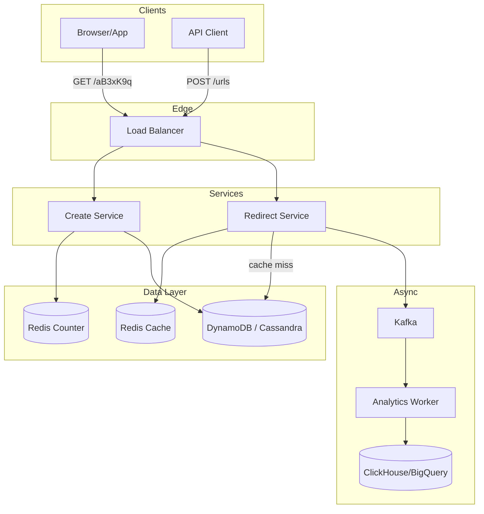

# URL Shortener — System Design

Design a service like bit.ly or TinyURL: convert long URLs to short codes, redirect in milliseconds, track click analytics.

---

## Requirements

### Functional
- Shorten long URL → short code (e.g. `abc.ly/aB3xK9q`)
- Redirect short URL → original long URL
- Optional custom alias
- Optional expiry date
- Click analytics (count, referrer, geo)

### Non-Functional
- Redirect latency **< 10ms** (p99)
- **100:1 read:write ratio** (redirects >> creates)
- **100M+** URLs stored
- **99.99%** availability for redirects
- Handle **10K+ redirects/second**

---

## Capacity Estimation

| Metric | Estimate |
|--------|----------|
| New URLs/day | 100M |
| Redirects/day | 10B (100× writes) |
| Peak redirect QPS | ~120,000/s |
| Storage | 100M URLs × 500B ≈ **50 GB** (fits one DB) |
| Analytics/day | 10B events ≈ **2 TB/day** raw → aggregated in batch |

---

## High-Level Architecture



---

## Core Flows

### 1. Create Short URL

**Option A — Counter + Base62 (recommended):**

```python
def create_short_url(long_url):
    id = redis.incr("global:counter")       # atomic increment
    code = base62_encode(id)                 # 123456789 → "aB3xK9q"
    db.put(code, { long_url, created_at, user_id })
    return f"https://abc.ly/{code}"

# Base62 charset: [a-zA-Z0-9] → 62^7 = 3.5 trillion unique codes
```

**Option B — Hash-based:**

```python
def create_short_url(long_url):
    hash = md5(long_url)[:7]
    code = base62_encode(int(hash, 16))
    if db.exists(code):
        code = code + salt_and_retry()       # collision handling
    db.put(code, long_url)
    return code
```

| Approach | Pros | Cons |
|----------|------|------|
| Counter + Base62 | No collisions, predictable length | Needs coordinated counter |
| Hash | Stateless, dedup same URL | Collision handling needed |

### 2. Redirect (hot path — optimize heavily)

```
GET /aB3xK9q

Redirect Service:
  1. Redis GET url:{aB3xK9q}
     → HIT: 302 redirect immediately (< 1ms)
  2. MISS: DynamoDB GET → populate Redis (TTL 1h) → 302 redirect
  3. Async: publish ClickEvent to Kafka (don't block redirect)

Response: HTTP 302 Location: https://original-long-url.com/...
```

**301 vs 302:**
| Code | Behavior | Use when |
|------|----------|----------|
| 302 | Temporary — browser doesn't cache | Need click analytics every time |
| 301 | Permanent — browser caches forever | Permanent links, SEO matters |

### 3. Analytics (async)

```
Kafka ClickEvent { code, timestamp, ip, user_agent, referrer, geo }
  → Analytics Worker → aggregate hourly
  → ClickHouse/BigQuery:
      code | date | clicks | top_countries | top_referrers
```

Never block redirect for analytics.

---

## Data Model

### DynamoDB / Cassandra

```
short_urls (
  short_code    VARCHAR PRIMARY KEY,    -- "aB3xK9q"
  long_url      TEXT,
  user_id       BIGINT,
  created_at    TIMESTAMP,
  expires_at    TIMESTAMP,              -- null = never
  click_count   BIGINT                  -- denormalized counter
)
```

### Redis

```
url:{short_code}    → long_url string (TTL 1 hour for hot URLs)
global:counter      → atomic ID generator
hot:urls            → sorted set of most clicked (for CDN pre-warm)
```

---

## API Design

| Method | Endpoint | Description |
|--------|----------|-------------|
| POST | `/v1/urls` | `{ "long_url": "...", "custom_alias": "...", "expires_at": "..." }` |
| GET | `/{short_code}` | Redirect (302) |
| GET | `/v1/urls/{code}/stats` | Click analytics |
| DELETE | `/v1/urls/{code}` | Deactivate URL |

**Rate limiting:** 100 creates/hour per API key. Redirects unlimited.

---

## Scaling Strategies

| Component | Strategy |
|-----------|----------|
| Redirect (120K QPS) | Redis cache — 80%+ hit rate, scale Redis cluster |
| Cache miss | DynamoDB on-demand capacity, DAX accelerator |
| Create | Low QPS — single region sufficient |
| Analytics | Kafka buffers spikes, batch write to OLAP |
| Popular URLs | CDN edge redirect for top 1% URLs |
| Global | Multi-region DynamoDB global tables |

---

## Security

- **TLS** for all endpoints
- **Rate limiting** on create API (prevent abuse)
- **URL validation** — block malware/phishing URLs (scan against blacklist)
- **Private URLs** — auth token required for redirect
- **No sensitive data** in short codes (don't encode user info)

---

## Interview Q&A

**Q: How generate short codes?**  
A: Global counter + Base62 encoding. 7 chars = 62^7 ≈ 3.5 trillion URLs. Atomic Redis INCR for counter.

**Q: How achieve < 10ms redirect?**  
A: Redis in-memory cache. 80-90% hit rate. Sub-ms on hit. DynamoDB DAX on miss. CDN for viral URLs.

**Q: 100:1 read:write — design implications?**  
A: Optimize redirect path exclusively. Separate read/write services. Async analytics. Cache everything.

**Q: How handle hash collision?**  
A: If using hash approach: detect collision on insert, append salt and re-hash. Counter approach avoids this entirely.

**Q: How scale to 10K redirects/sec?**  
A: Redis cluster (100K+ ops/sec). Stateless redirect servers behind LB. DynamoDB for persistence. Kafka for analytics decoupling.

**Q: Custom alias support?**  
A: Check uniqueness on create. Store in same table. Reserve premium aliases separately.

**Q: URL expiration?**  
A: Store `expires_at`. Redirect service checks before redirect. Background job deletes expired entries. Redis TTL mirrors DB expiry.

**Q: How estimate storage for 100M URLs?**  
A: ~500 bytes/record × 100M = 50 GB. Fits single DynamoDB partition with proper key design. Shard by short_code prefix if needed.

---

## Tech Stack Summary

| Layer | Technology |
|-------|------------|
| Redirect cache | Redis Cluster |
| Persistent store | DynamoDB / Cassandra |
| Analytics | Kafka + ClickHouse |
| Counter | Redis INCR |
| API | Go/Node.js (low latency) |
| CDN | CloudFront (hot URLs) |

[← Back to index](../README.md)
